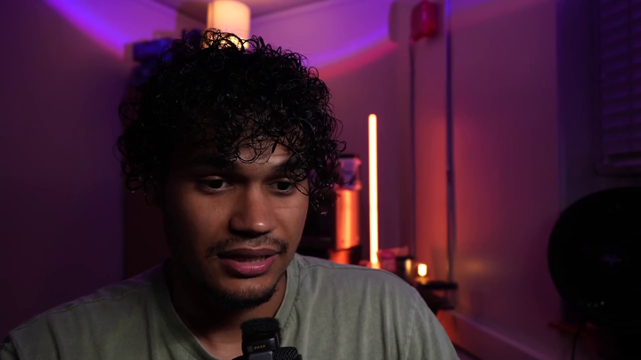
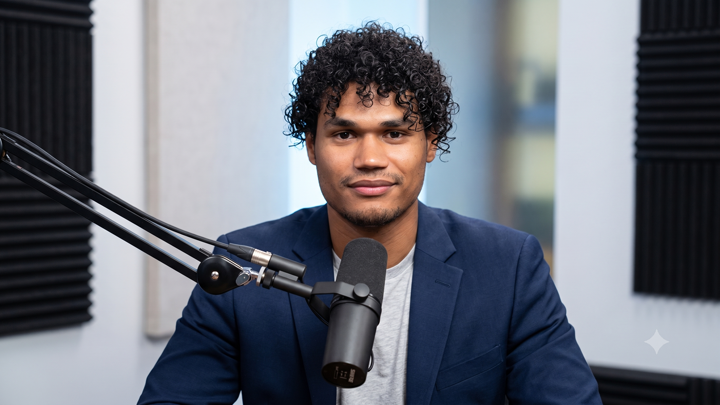
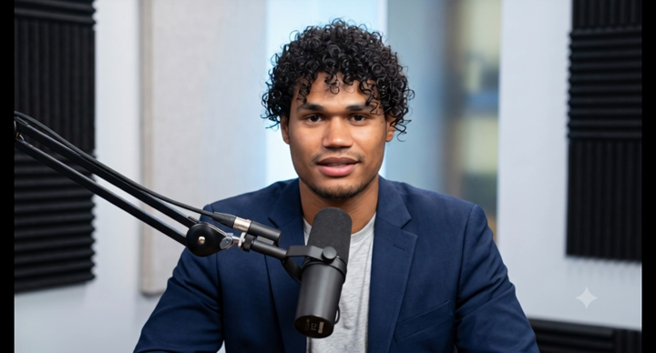
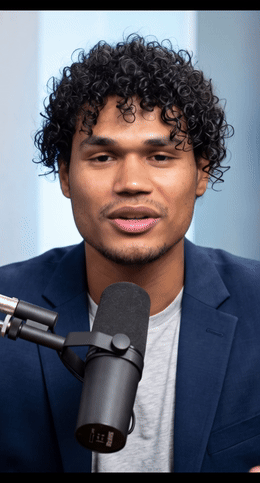

# EasyWebinar AI Avatar Generation Pipeline

Serverless AI avatar video generation on [Modal.com](https://modal.com). A host onboards **once**
(voice + a clean reference image); afterwards every request is just `host_id` + a script +
aspect ratio → a lip-synced, expressively-voiced talking-head video in the host's voice and
likeness, in any format.

> **Architecture note (2026):** this pipeline was migrated off the original EchoMimicV2 +
> face-restoration design onto **Wan2.2-S2V-14B** (audio-driven video diffusion). The numbered
> specs in [`docs/`](docs/) `03`–`08` and `FULL-SPEC.md` describe the **original** design and are
> kept for history — they're marked `LEGACY` at the top. The **current** system is documented in
> [`docs/01-architecture-overview.md`](docs/01-architecture-overview.md),
> [`docs/02-models.md`](docs/02-models.md), and [`OPS_RUNBOOK.md`](OPS_RUNBOOK.md).

## What it does

- **Onboard a host once** — from a short clip (or an existing webinar), we clone/assign a voice
  and build a clean **studio reference portrait** of them. Stored as a `host_id` profile.
- **Generate per request** — send `host_id` + script + aspect ratio. The pipeline directs the
  script, synthesizes speech (ElevenLabs *or* Fish Audio), animates the reference with
  Wan2.2-S2V, and returns a finished MP4.

## Showcase

An arbitrary real clip becomes a clean, format-native talking-head avatar — same person, restaged
and animated to a new script:

| 1 · Real input frame | 2 · AI studio reference | 3 · Generated output |
|:---:|:---:|:---:|
|  |  |  |
| messy webcam grab — dark, RGB-lit | nano-banana re-stages it clean (**same person**) | Wan2.2-S2V animates it to the script |

**Vertical reels too** — same host, 9:16, lip-synced to the generated voice:



## Layout

| File | Role |
|---|---|
| `app.py` | Modal `App`, container images, Volumes, host-profile + jobs `Dict`, secrets, health checks, `download_weights`, `download_distill_lora` |
| `constants.py` | All tunable config — Wan sampling/distill, aspect helpers, TTS providers, studio-reference gates |
| `director.py` | Stage 0 — LLM audio director (Groq `gpt-oss-120b`), inserts `eleven_v3` tags + content-preservation guardrail |
| `tts.py` | Stage A — TTS provider dispatch: **ElevenLabs v3** or **Fish Audio s2.1-pro** |
| `store.py` | `ProfileStore` — Modal-Dict (prod) / Postgres (POC) backends; `HostProfile` incl. per-aspect references |
| `onboard.py` | Onboarding — consent → voice clone (or `--voice-id` override) → studio reference; CLI helpers (`onboard_existing`, `set_reference`, `set_voice_id`, `regenerate_reference`) |
| `reference_studio.py` | Best-frame pick (InsightFace) + nano-banana studio-reference reimagining + `crop_reference_to_ratio` |
| `generate_stage.py` | **Function A (GPU)** — Wan2.2-S2V-14B, 4-step distill LoRA, face-aware aspect crop, full-quality audio mux |
| `main_generate.py` | `/generate` async orchestration + `/status` + `/video` (streamed) |
| `frontend.py` | Demo control panel (onboard + generate + TTS A/B + inline playback) |

**Removed in the Wan migration:** `prep.py`, `restore.py`, `composite.py`, `temporal_blend.py`,
`spikes.py` (EchoMimicV2 + restorer + Function B are gone — Wan-S2V does it in one GPU step).

**Local helper scripts** (not part of the deployed app): `download.py` (fetch a source webinar
clip), `trim.py` / `reencode.py` (cut + normalize an onboarding clip), `test.py` (endpoint smoke
call). `showcase.html` is a static results page. Dependency sets are recorded in
[`requirements/`](requirements/) for reference — the real images are built inline in `app.py`.

## Container images (`app.py`)

- **onboarding_image** (CPU, ffmpeg, yt-dlp) — onboarding endpoint
- **director_tts_image** (CPU) — director + TTS + `/generate` orchestration
- **wan_image** (GPU, torch 2.4/cu124, flash-attn, Wan2.2 repo) — Function A (Wan2.2-S2V)
- **studio_image** (CPU, InsightFace, opencv, google-genai) — Reference Studio
- **weights_image** / **frontend_image** — weight download / demo panel

## Quick start

See [`OPS_RUNBOOK.md`](OPS_RUNBOOK.md) for the full sequence. Short version:

```bash
pip install modal && py -m modal setup
# drop a .env (ELEVENLABS_API_KEY, GROQ_API_KEY, GEMINI_API_KEY, FISH_API_KEY,
#   APP_BEARER_TOKEN, MODAL_PROXY_KEY/SECRET, ONBOARD_URL, GENERATE_URL), then:
py -m modal deploy app.py
py -m modal run app.py::download_weights          # ~49GB Wan2.2-S2V weights (once)
py -m modal run app.py::download_distill_lora      # ~631MB 4-step distill LoRA (once)
py -m modal run app.py::health_all
```
Then open the control panel URL (printed by `modal deploy`) to onboard + generate.
(`py -m modal` avoids a common Windows PATH issue — see the runbook.)

## Status & honest caveats

- **Quality validated** — Wan2.2-S2V output (identity, motion, lip-sync) confirmed good.
- **Speed:** 4-step distill ≈ 4× faster; ~4 min render for a 30s clip (warm) at 480p.
- **Cold start ≈ 2.5 min** (fresh GPU build; memory snapshots don't work with Wan's conv3d —
  see [`OPS_RUNBOOK.md`](OPS_RUNBOOK.md)). Use `min_containers=1` for a zero-cold-start demo.
- **nano-banana (Gemini image) requires paid API billing** — currently blocked (`limit:0`), so
  studio references are made by hand (Gemini app) and registered with `set_reference`.
- **Aspect / reels:** output aspect follows the reference; per-aspect references + face-aware
  crop give proper 9:16.
- **Roadmap:** action/motion replication from a driving video (Wan2.2-Animate) — not yet built.
