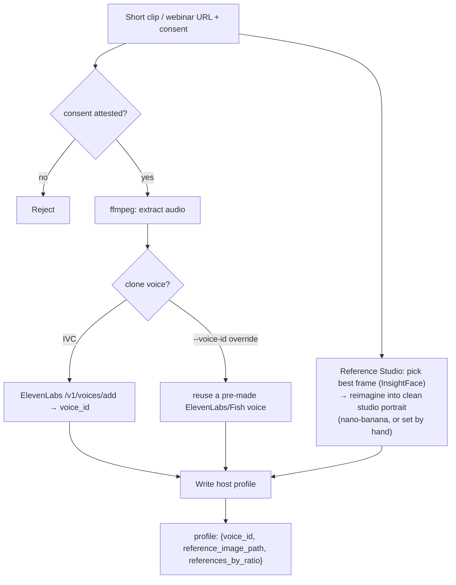
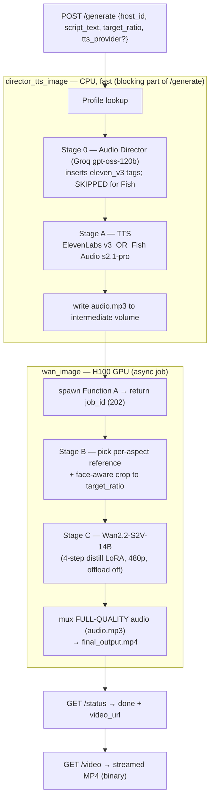

# Architecture Overview

> **Current architecture (Wan2.2-S2V).** This replaces the original EchoMimicV2 + restorer design
> (see `LEGACY`-bannered docs 03–08 / FULL-SPEC for history).

## Feature overview — two flows

1. **Host onboarding (once per host).** A short clip (or an existing webinar) produces a stored
   **host profile**: a voice (an ElevenLabs Instant Voice Clone, *or* a pre-made ElevenLabs/Fish
   voice assigned via override) + a clean **studio reference portrait**. Stored as
   `host_id → {voice_id, reference_image_path, references_by_ratio, ...}`.
2. **Generation (every request).** Caller sends `host_id` + `script_text` + `target_ratio`
   (+ optional TTS provider / voice overrides). No upload, no per-request voice data — the
   profile supplies everything. Because Wan takes minutes, this is an **async job**.

Entirely serverless on Modal — no persistent process; each request triggers a chain of Modal
Function calls, thin CPU ones (director, TTS, orchestration) and one heavy GPU one (Wan-S2V).

## Onboarding (once per host)

## Generation (async, per request)

## Data-flow table

| After stage | Artifact | Notes |
|---|---|---|
| Profile lookup | `{voice_id, reference_image_path, references_by_ratio}` | one read per request, keyed by `host_id` |
| Stage 0 | `{clean_text, directed_text, stability_hint}` | ElevenLabs only; Fish uses `clean_text` |
| Stage A | `audio.mp3` | ElevenLabs v3 (tagged) / multilingual_v2, or Fish s2.1-pro |
| Stage B | reshaped reference PNG | reference cropped to `target_ratio`, centered on the face |
| Stage C | `final_output.mp4` (video) | Wan-S2V, 480p, `num_repeat = ceil(audio_secs/5)` sequential chunks |
| mux | `final_output.mp4` (final) | 44.1 kHz original audio muxed in (not the 16 kHz lip-sync track) |

## Environment split (why the images differ)

- **onboarding_image / director_tts_image (CPU)** — API calls only (ffmpeg, ElevenLabs, Fish,
  Groq, store). No GPU.
- **wan_image (H100 GPU)** — the entire animation now lives in **one** GPU function
  (`WanAvatar.run`). Wan2.2-S2V does audio-driven generation end-to-end, so there is **no
  Function B / restorer / temporal-blend / composite** (all removed in the migration).
- **studio_image (CPU)** — InsightFace best-frame + nano-banana reimagine + `crop_reference_to_ratio`.
  Kept off `wan_image` so it builds fast and needs no torch/CUDA.

The thin stages finish synchronously inside `POST /generate` (director + TTS are seconds); then
Function A is **spawned** and the caller polls. Function A reads `audio.mp3` and the reference off
the shared intermediate Volume under a per-request `run_id` (== `job_id`) and writes
`final_output.mp4` back to it, which `/video` streams.

## Speed & cost shape

Total GPU time ≈ `num_repeat × steps × pixels`. `num_repeat = ceil(audio_secs / 5)` (chunks are
autoregressive — each conditions on the previous, so they can't be parallelized). Levers applied:
**480p** (`WAN_MAX_AREA`), **4-step distill LoRA** (vs 40), **offload off**, **bf16**. Result:
~4 min for a 30 s clip warm. Cold start ≈ 2.5 min (fresh GPU build; snapshots are incompatible
with Wan's conv3d — see OPS_RUNBOOK). `WAN_MAX_SECONDS` caps duration as a cost guard.
