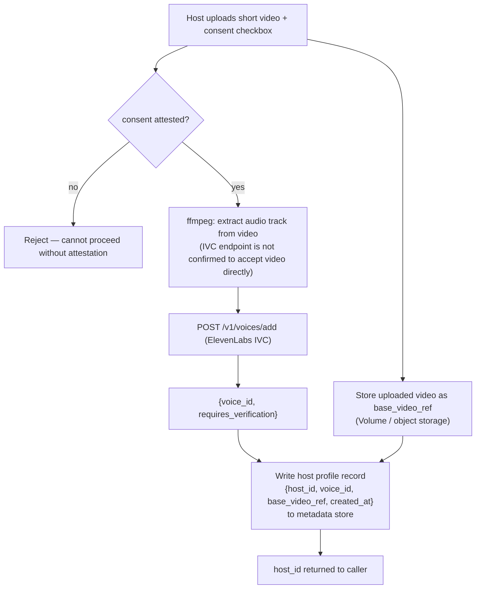
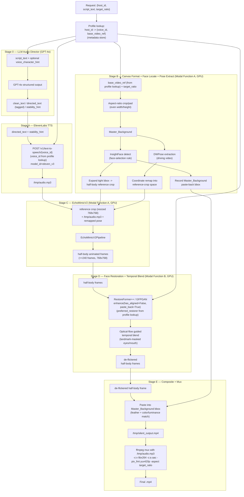

> **LEGACY / historical.** This document predates the Wan2.2-S2V migration and describes the original EchoMimicV2 + face-restoration design. For the current system, see `docs/01-architecture-overview.md`, `docs/02-models.md`, and `OPS_RUNBOOK.md`.

# EasyWebinar AI Avatar Pipeline — Full Combined Specification

> Single-file concatenation of `README.md` + `01` through `07` for easier handoff/reading.
> The individual numbered files in `docs/` remain the source of truth — this file is a mirror,
> regenerated after edits land there, not maintained independently. (The phase-wise
> [08-implementation-plan.md](08-implementation-plan.md) is intentionally kept separate, not folded
> into this file — it's a build roadmap, not architecture reference.)

## Table of Contents

1. [README — Index & Key Corrections](#easywebinar-ai-avatar-generation-pipeline--developer-documentation)
2. [01 — Architecture Overview](#architecture-overview)
3. [02 — Model-wise Info](#model-wise-info)
4. [03 — Business Logic](#business-logic--how-the-stages-actually-chain-together)
5. [04 — API Endpoints](#api-endpoints)
6. [05 — Infrastructure (Modal.com)](#infrastructure--modalcom-setup)
7. [06 — Development & Testing Protocol](#development--testing-protocol)
8. [07 — Risks and Open Questions](#risks-and-open-questions)

---

# EasyWebinar AI Avatar Generation Pipeline — Developer Documentation

This is the developer-facing design documentation for a serverless AI Avatar video
generation pipeline for EasyWebinar. A host onboards **once** with a short video of
themselves (cloning their voice and capturing their animation reference); from then on, every
generation request is just a `host_id` + a narration script + a target aspect ratio, producing
a lip-synced, expressively-voiced, aspect-ratio-locked talking-head video in the host's own
cloned voice, deployed on [Modal.com](https://modal.com).

This documentation was written **before any code exists**. It replaces and corrects an
initial build spec ("Mission Objective") that, on verification against the real upstream
projects (ElevenLabs, EchoMimicV2, BFVR-STC, Modal.com), turned out to contain several
assumptions that do not hold. Read the corrections box below before writing any code.

## How to read these docs

| File | Contents |
|---|---|
| [01-architecture-overview.md](01-architecture-overview.md) | Feature overview, end-to-end pipeline diagram, data flow, environment split |
| [02-models.md](02-models.md) | Model-wise info: GPT-4o Director, ElevenLabs TTS, EchoMimicV2, RestoreFormer++/GFPGAN + custom temporal blend |
| [03-business-logic.md](03-business-logic.md) | How the stages actually chain together: crops, coordinate remaps, aspect-ratio math, compositing |
| [04-api-endpoints.md](04-api-endpoints.md) | Every HTTP endpoint: request/response schema, auth, errors |
| [05-infrastructure-modal.md](05-infrastructure-modal.md) | Modal Image/Volume/GPU/Secrets/scaling setup, current API only |
| [06-development-testing-protocol.md](06-development-testing-protocol.md) | Phased build plan, `test.py` design, debugging playbook |
| [07-risks-and-open-questions.md](07-risks-and-open-questions.md) | Licensing status, unverified items, decisions requiring follow-up |
| [08-implementation-plan.md](08-implementation-plan.md) | The actual phase-wise build roadmap (Phase 0-12) — start here to write code |
| [FULL-SPEC.md](FULL-SPEC.md) | Single-file concatenation of every doc above, for easier handoff/reading |

## If you read nothing else: 11 corrections to the original spec

The original build spec was written without checking the real upstream repos/docs. Building
strictly to it as originally worded will not work. These corrections are foregrounded here
and re-stated in the relevant detail doc — do not silently "fix" the docs back toward the
original spec's wording without re-reading the reasoning below.

1. **EchoMimicV2 is not 512×512.** Its default and tested resolution is `768×768`
   (configurable; 1024 causes documented ghosting). It also needs a **pose sequence** input
   the original spec never mentioned — extracted via DWPose from a driving video and
   spatially aligned to the reference image. Without it, the model cannot run.
2. **BFVR-STC is genuinely 512×512-locked**, but its inference script has a **hard-coded
   24-frame cap**, does **no internal face detection**, and **drops audio** — none of which
   the original spec accounted for.
3. **EchoMimicV2 and any BFVR-STC-like restorer cannot share one Python environment** — pinned
   `torch`/`diffusers`/`numpy` versions hard-conflict. They must be two separate Modal
   Functions with two separate container images.
4. ~~BFVR-STC licensing risk~~ — **superseded by correction #7 below: BFVR-STC has been
   dropped entirely.**
5. **Weight hosting differs per model.** Hugging Face `snapshot_download` works for
   EchoMimicV2's weights, but not for everything (Whisper is a raw URL) — verify hosting
   per-model, never assume.
6. **The original spec's Modal API is outdated.** `modal.Stub` → `modal.App`; `@stub.function`
   → `@app.function`; `@modal.web_endpoint` → `@modal.fastapi_endpoint`; `gpu="RTX4090"` is
   **not a valid Modal GPU string** (no such SKU exists on Modal); `container_idle_timeout`/
   `keep_warm`/`concurrency_limit` → `scaledown_window`/`min_containers`/`max_containers`.
7. **BFVR-STC is replaced entirely — no permissively-licensed drop-in for video-native face
   restoration exists.** Every model actually built for temporal-consistent face-video
   restoration (KEEP, PGTFormer, DicFace, SVFR) is non-commercial-licensed, unlicensed, or
   built on a revenue-capped base model. Decision: **RestoreFormer++ (Apache-2.0)** as primary
   per-frame restorer, **GFPGAN v1.4 "clean" (Apache-2.0)** as fallback, plus a **custom
   in-house optical-flow temporal-blending pass** to handle flicker — since no permissive model
   does that natively. This is a new architecture piece, not a battle-tested drop-in.
8. **A new "LLM Audio Director" stage (GPT-4o) runs before TTS.** It annotates the script with
   ElevenLabs `eleven_v3` inline audio tags (`[excited]`, `[whispers]`, `[pause]`, etc.) for
   expressive delivery, without altering wording. This also changes the TTS model choice from
   a plain default to **`eleven_v3`** specifically (tags are v3-exclusive).
9. **Don't hand-roll a crop/resize/paste-back around the face restorer.** RestoreFormer++ and
   GFPGAN both ship their own face-detection + alignment + inverse-affine paste-back pipeline
   (`enhance(..., has_aligned=False, paste_back=True)`). Feeding them a manually-cropped,
   non-aligned face is a documented failure mode. Call the library's own pipeline on the full
   half-body frame.
10. **The face-crop used for EchoMimicV2's reference image and the face-crop used for
    restoration are two different things.** InsightFace returns a *tight* face bounding box;
    EchoMimicV2 expects a *half-body/chest-up* reference framing. Feeding the tight bbox
    straight into EchoMimicV2 (a literal reading of the original spec) produces an
    out-of-distribution, face-filling frame that breaks animation quality — not just a
    resolution nit. Stage B must derive an **expanded** half-body region for EchoMimicV2,
    separate from whatever crop the restoration stage's own library performs internally.
11. **`voice_id` and the base video are not per-request fields — they belong to a one-time
    host onboarding step.** A host uploads a short video once; its audio becomes an ElevenLabs
    Instant Voice Clone and the video itself becomes their fixed animation reference, stored as
    a `{host_id → voice_id, base_video_ref}` profile the pipeline owns itself (a `modal.Dict` +
    `modal.Volume`, not an existing EasyWebinar backend integration). Every generation request
    after that supplies only `host_id`. See [01-architecture-overview.md](01-architecture-overview.md)'s
    "Host Onboarding" section and [02-models.md](02-models.md) §2a for the Instant Voice Clone
    specifics — and note the **lead item in
    [07-risks-and-open-questions.md](07-risks-and-open-questions.md)**: whether ElevenLabs' ToS
    actually permits a host commercially redistributing their own self-cloned voice is
    unverified, and it's the legal premise this whole feature depends on.

See [07-risks-and-open-questions.md](07-risks-and-open-questions.md) for everything that is
still genuinely open (licensing nuances, unverified API details, unproven design pieces) —
don't treat silence on a topic elsewhere in these docs as "resolved," check that file.

---

# Architecture Overview

## Feature overview

There are two flows, not one:

1. **Host onboarding (once per host)** — a host uploads a short video of themselves. That
   single video does double duty: its audio becomes the source for an ElevenLabs Instant
   Voice Clone (so narration sounds authentically like the host, not a generic stock voice —
   the entire point being that the host can post the resulting videos to their own social
   media without it reading as a synthetic voice), and the video itself becomes their fixed
   half-body reference/driving footage for animation. This produces a stored **host profile**
   (`host_id` → `{voice_id, base_video_ref}`) — see [Host Onboarding](#host-onboarding-stage--1-one-time)
   below.
2. **Generation (every time a host wants a new video)** — the host supplies just a `host_id`,
   a narration script, and a target aspect ratio. No video upload, no voice selection — the
   pipeline looks up the stored profile and reuses it. This is the `Stage 0` → `Stage E` flow
   documented below.

The pipeline is entirely serverless, deployed on Modal.com. It has no persistent server
process — each request (onboarding or generation) triggers a chain of Modal Function calls,
some of which are plain API calls (no GPU) and some of which run GPU-backed model inference.

## Host Onboarding (Stage -1, one-time)



This runs **once per host** (with an explicit re-onboarding path to replace the profile, since
the design is "single profile, replaceable" — not a versioned library of videos). It is not
part of the per-generation request path below; a generation request only ever supplies
`host_id`, never raw `voice_id`/video data. See
[03-business-logic.md](03-business-logic.md) for the audio-extraction and consent-attestation
contract, [04-api-endpoints.md](04-api-endpoints.md) for the `POST /host/onboard` schema, and
[05-infrastructure-modal.md](05-infrastructure-modal.md) for the metadata store and video
storage this writes to.

## Revised pipeline (generation flow — runs on every request, after onboarding)



## Data-flow table

| After stage | Artifact | Format / notes |
|---|---|---|
| Profile lookup | `{voice_id, base_video_ref, preferred_restorer}` | Fetched once per generation request from the metadata store, keyed by `host_id` — see [05-infrastructure-modal.md](05-infrastructure-modal.md). `preferred_restorer` was decided once, at onboarding time (see [02-models.md](02-models.md) §4a) — Stage D never decides it at generation time. |
| 0 | `directed_text` result | JSON: `{clean_text, directed_text, stability_hint}` |
| A | `/tmp/audio.mp3` | MP3 (or configured `output_format`), rendered via `eleven_v3` |
| B | `Master_Background` frames | Aspect-ratio-locked frames, even width/height, arbitrary base resolution |
| B | face bbox (tight) + selection metadata | InsightFace detection result, one face selected |
| B | half-body reference crop | Square-padded, resized to 768×768 for Stage C input |
| B | Master_Background paste-back bbox | Recorded once, used only in Stage E |
| B | pose `.npy` sequence | DWPose per-frame keypoints, remapped into reference-crop coordinate space |
| C | `/tmp/echomimic_out.mp4` (or frame sequence) | Half-body animated frames, 768×768, ≤240 frames, H.264/AAC per EchoMimicV2's own moviepy re-mux |
| D | restored + blended frames | Half-body, 768×768, video-only (no audio) |
| E | `/tmp/silent_output.mp4` | Composited into Master_Background, video-only |
| E | final `.mp4` | Muxed with `/tmp/audio.mp3`, H.264/AAC, `yuv420p`, `-aspect` metadata locked |

## Three-environment justification (plus onboarding as a separate, fourth flow)

Nothing in this pipeline is a single monolithic Modal Function. The **generation** flow splits
into three independent execution environments because their dependencies and hardware needs
don't mix:

1. **Stage 0 + Stage A (thin, CPU-only)** — a profile lookup, a GPT-4o API call, and an
   ElevenLabs API call. Neither needs a GPU or any of the ML stack. Runs as a lightweight Modal
   Function (or the calling code path immediately before Function A is invoked) with only
   `openai` and `requests`/`elevenlabs` SDKs installed, plus a metadata-store client for the
   profile lookup. **Must complete before Function A starts** — Stage C needs the finished
   `/tmp/audio.mp3` as an input.
2. **Modal Function A (heavy GPU)** — canvas formatting, InsightFace detection, reference-crop
   derivation, DWPose extraction/remap, and EchoMimicV2 inference. This is the VRAM-heavy stage
   (diffusion UNet + VAE + motion module + audio encoder, confirmed ~16GB+ minimum).
3. **Modal Function B (separate, lighter GPU)** — face restoration (RestoreFormer++/GFPGAN,
   feedforward GAN, no diffusion stack), the custom temporal-blend pass, final compositing, and
   the ffmpeg mux. Its dependency set (opencv, basicsr/facexlib-style helpers, no `diffusers`)
   hard-conflicts with Function A's pinned `torch`/`diffusers` versions (see
   [02-models.md](02-models.md)), so it must be a separate container image, not a shared one.

Functions A and B hand off intermediate artifacts (the half-body animated frames) via a shared
`modal.Volume`, not in-process objects — see [05-infrastructure-modal.md](05-infrastructure-modal.md)
for the `commit()`/`reload()` semantics this requires.

**Onboarding (Stage -1) is a separate flow entirely**, not one of the three generation-time
environments — it runs once per host, on its own thin CPU-only Function shape (similar to
Stage 0/A: ffmpeg audio extraction + an ElevenLabs IVC call), but it also owns writes to the
new metadata store and video storage that generation-time only ever *reads* from. It has no
GPU dependency and never touches Function A or B.

## Why this isn't the original spec's "single `app.py`, 5-step" design

The original spec described this as five simple steps in one file. In practice:
- Step B is really three sub-steps producing three different artifacts (half-body reference
  crop, paste-back bbox, remapped pose) that get consumed at different points downstream — see
  [03-business-logic.md](03-business-logic.md).
- Steps C and D cannot run in the same container (dependency conflict) or even necessarily the
  same GPU tier (D is much lighter once benchmarked).
- Step D is not the originally-planned model at all (BFVR-STC is dropped — see
  [02-models.md](02-models.md) and [07-risks-and-open-questions.md](07-risks-and-open-questions.md)).
- A new Stage 0 (LLM Director) sits in front of the original Step A.

None of this changes the product-level behavior described to the user (script + video +
aspect ratio → avatar video) — it changes how many Modal Functions and container images the
implementation actually needs.

---

# Model-wise Info

Four model/service components make up the pipeline: an LLM script director, a TTS service,
a diffusion-based lip-sync/animation model, and a face-restoration + custom temporal-blend
stage. Each subsection below covers: purpose, exact inputs/outputs, dependencies, weight
sourcing, VRAM/perf, and license.

---

## 1. LLM Audio Director (GPT-4o)

**Purpose**: Take the plain `script_text` the user wrote and produce a version annotated with
ElevenLabs `eleven_v3` inline audio tags, so the resulting speech sounds expressive rather than
flat — without altering the actual wording, since this is narration the user deliberately
authored.

**Role framing (system prompt content)**:
> "You are an audio director. You annotate narration scripts for expressive text-to-speech.
> You NEVER change, add, remove, or reorder words, facts, or sentence structure from the
> user's script — output must be word-for-word identical to the input except for inserted
> bracketed tags, capitalization changes for emphasis, and ellipses/punctuation adjustments
> for pacing."

**Closed tag vocabulary** (standardize on this list; do not let the LLM invent new tags —
pulled from ElevenLabs' actual docs/blog, excluding experimental accent/SFX/dialogue-only
tags not relevant to single-speaker webinar narration):

```
Emotion:   [excited] [nervous] [frustrated] [sorrowful] [calm] [sad] [angry]
           [happily] [curious] [sarcastic] [mischievously] [awe]
Delivery:  [whispers] [shouts] [rushed] [drawn out] [dramatic tone]
Reactions: [laughs] [laughs softly] [sighs] [exhales] [gasps] [clears throat]
Pacing:    [pause] [hesitates]
```

**Placement rule to give the LLM**: "Insert a tag immediately before the word(s) it should
affect. Each tag influences roughly the next 4-5 words of speech before delivery reverts to
neutral — do not expect one tag to carry across a whole paragraph. Only tag where the delivery
genuinely shifts; do not over-tag every sentence." Also instruct: use ALL CAPS for word-level
emphasis, ellipses (`...`) for dramatic pauses/trailing off, and standard punctuation for
pacing — **not SSML** (`eleven_v3` does not support `<break time="x"/>` or other SSML tags).

**Structured output contract** (via OpenAI Structured Outputs / `response_format:
{type: "json_schema", ...}`, supported on `gpt-4o-2024-08-06` and later):

```json
{
  "clean_text": "verbatim pass-through of the input script",
  "directed_text": "tag-annotated version of clean_text",
  "stability_hint": "creative | natural"
}
```

- `stability_hint` should be `"creative"` when the director inserted a high density of tags
  (maximize expressiveness, accepting some hallucination risk) and `"natural"` for lighter
  annotation — this maps directly to the `voice_settings.stability` sent to the TTS call (see
  §2 below).
- Optionally accept a `voice_character_hint` input field (e.g. "warm, calm female narrator")
  so the director doesn't request tags that contradict the target voice (e.g. no `[shouts]`
  for a hushed voice).

**Content-preservation guardrail**: after the director call, strip all `[...]` tags,
capitalization, and inserted punctuation from `directed_text` and confirm the result equals
`clean_text` (case/whitespace-normalized). Reject/retry the director call if this check fails
— this is the safety net against the LLM silently rewriting content.

**Dependencies**: OpenAI Python SDK (or plain `requests` against the Chat Completions /
Responses API). No GPU. Runs in the thin CPU-only Stage 0/A environment (see
[01-architecture-overview.md](01-architecture-overview.md)).

**Cost/latency** (secondary-sourced — reverify against `openai.com/api/pricing` before
finalizing cost estimates): roughly $2.50/1M input tokens, $10/1M output tokens for GPT-4o;
~16× cheaper on `gpt-4o-mini` if quality is acceptable. For a few paragraphs of narration,
expect low hundreds to ~1-2k output tokens and single-digit-second latency — well within
tolerance ahead of a render that itself takes much longer.

**License**: N/A (hosted API, not open-weight).

---

## 2. ElevenLabs Text-to-Speech

**Purpose**: Render `directed_text` (or `clean_text`, if the director is bypassed) into
`/tmp/audio.mp3`.

**Endpoint**: `POST https://api.elevenlabs.io/v1/text-to-speech/{voice_id}`

**Headers**: `xi-api-key: <key>` (treat as required despite the OpenAPI schema marking it
optional — ElevenLabs' own auth docs state every request must include it), `Content-Type:
application/json`. Store the key in a `modal.Secret`, injected only into the Function(s) that
call ElevenLabs — never exposed via the pipeline's public web endpoint.

**Request body** (key fields):
```json
{
  "text": "directed_text (or clean_text)",
  "model_id": "eleven_v3",
  "voice_settings": {
    "stability": 0.25,
    "similarity_boost": 0.75,
    "style": 0,
    "use_speaker_boost": true
  },
  "apply_text_normalization": "auto"
}
```

**Model selection — decision, not a default carried over from generic ElevenLabs guidance**:
- **`eleven_v3`** whenever `directed_text` contains inline tags — tags are effectively
  exclusive to this model (not `eleven_flash_v2_5`/`eleven_multilingual_v2`; sending tagged
  text to those models will likely have tags spoken literally or stripped — **UNVERIFIED**,
  test empirically). `eleven_v3`'s higher latency vs. Flash models is a non-issue here since
  webinar narration is pre-rendered, not real-time.
- **`eleven_multilingual_v2`** as a fallback for non-tagged text (e.g., `enable_director=false`
  requests) — higher character limit (10,000 vs. 5,000), no tag support needed.
- Do **not** default to `eleven_flash_v2_5` (a reasonable choice if this were a
  latency-sensitive/real-time product, but tags — the whole point of Stage 0 — require v3).

**Character limits** (per request, model-dependent):
- `eleven_v3` standard TTS: **5,000 characters**. A third-party source reports a possibly
  revised 3,000-char limit post-GA — **UNVERIFIED, conflicting**, reverify against the live API
  before finalizing. `eleven_v3` Text-to-Dialogue (multi-speaker): 2,000 characters — not
  relevant unless multi-speaker webinars are added later.
- `eleven_multilingual_v2`: 10,000 characters.
- The director/TTS contract (see [03-business-logic.md](03-business-logic.md)) must check
  `directed_text` length against the applicable limit *before* sending, and reject/chunk if
  exceeded — do not rely on the API to reject gracefully.

**Tag syntax/placement/scope** (see §1 for the closed vocabulary): lowercase words in square
brackets, placed immediately before the affected span, each tag's effect lasting ~4-5 words.
Capitalization = emphasis, ellipses = pacing. Tag reliability depends on the target voice
(don't expect `[shouts]` to work on a voice with no loud training samples) and on the
`stability` setting:

| Stability preset | Behavior |
|---|---|
| Creative (low, ~0.2-0.35 — **UNVERIFIED exact numeric band**, ElevenLabs names these as UI presets not raw numbers) | Most emotional/expressive, most tag-responsive, prone to hallucination |
| Natural (mid, ~0.4-0.6 — UNVERIFIED) | Balanced, closest to reference recording |
| Robust (high, ~0.7+ — UNVERIFIED) | Stable but tags are largely dampened/ignored |

Use Creative/Natural whenever `directed_text` carries tags; don't bother tagging text destined
for a Robust/high-`stability` voice setting. `voice_settings.speed` support on `eleven_v3` is
**UNVERIFIED/conflicting across sources** — test directly; if unsupported on v3, route all
pacing through tags/punctuation instead.

**Voices**: current endpoint is `GET https://api.elevenlabs.io/v2/voices` (the commonly-cited
`/v1/voices` may or may not still exist as a legacy alias — **UNVERIFIED**, spec against v2).
`voice_id` is an opaque ~20-char alphanumeric token. Every `voice_id` used for generation in
this pipeline is a **host's own cloned voice**, produced once at onboarding time (below), not a
stock/library voice selected per request.

### 2a. Instant Voice Clone (IVC) — used at host onboarding, not per-generation

**Purpose**: turn the host's onboarding video into a `voice_id` that sounds like them, so
generated narration is authentically their voice rather than a generic stock voice — the
product requirement motivating this whole onboarding stage.

**Endpoint (confirmed)**: `POST https://api.elevenlabs.io/v1/voices/add`

**Request** (multipart): `name` (required), `files[]` (required — **audio only**; see file-
format note below), optional `description`, `labels`, `remove_background_noise` (bool, default
`false` — worth enabling here since a host's self-recorded onboarding video's audio is unlikely
to be studio-clean).

**Response (confirmed)**: `{"voice_id": "...", "requires_verification": <bool>}`. Processing is
synchronous — IVC is few-shot conditioning, not a trained model, so `voice_id` is usable
immediately in `POST /v1/text-to-speech/{voice_id}` with no separate wait/polling step.

**Audio duration**: ~1-2 minutes of clean audio recommended, avoid exceeding ~3 minutes — this
is comfortably satisfied by a "short onboarding video," which is why IVC (not PVC, below) is
the right fit here.

**File format — a real design constraint, not a research footnote**: no official source
confirms this endpoint accepts a video container directly; accepted formats are audio-only
(MP3/WAV/M4A/FLAC per ElevenLabs' help documentation). **The onboarding flow must extract the
audio track from the host's uploaded video with ffmpeg before calling this endpoint** — do not
assume the API extracts it. See [03-business-logic.md](03-business-logic.md) for the exact
onboarding contract.

**Consent**: ElevenLabs requires a checkbox-style attestation ("I confirm I have all necessary
rights/consent to clone this voice") before an IVC upload completes — a UI/API-level
acknowledgment, not an algorithmically-verified spoken phrase. Since the host is cloning their
own voice with their own consent, this is straightforward to satisfy, but it must be a real,
enforced step in the onboarding flow (see [03-business-logic.md](03-business-logic.md) and
[07-risks-and-open-questions.md](07-risks-and-open-questions.md) for why this alone doesn't
settle the deeper legal question of commercial redistribution).

**`requires_verification`**: its downstream effect is **UNVERIFIED** — whether a `voice_id`
flagged `true` is usable immediately or blocked pending review was not confirmed by research.
Test empirically with a real account before assuming "always immediately usable."

**Quota**: ElevenLabs gates the number of custom voices per workspace by plan tier. Confirmed
numbers exist for **Professional Voice Clone** slots specifically (0 on Free/Starter, 1 on
Creator/Pro, up to 10 on Business) — IVC-specific slot numbers were not directly confirmed, but
the same slot-pool concept likely applies. Since this design creates **one IVC voice per
onboarded host**, host-count growth consumes this quota directly — see
[07-risks-and-open-questions.md](07-risks-and-open-questions.md), this is a real scaling risk,
not a footnote.

**Why IVC and not Professional Voice Clone (PVC)**: PVC needs 30+ minutes of audio (2-3 hours
recommended) and hours of training time, plus a mandatory verification-recording step distinct
from IVC's consent checkbox — none of which a single short onboarding video can realistically
supply. PVC also carries an unresolved (alpha-era, not confirmed retracted post-GA) caveat
about lower tag-responsiveness quality with `eleven_v3` — IVC sidesteps that entirely. Both
IVC and PVC voices are confirmed to support the full `eleven_v3` tag system once created; the
open question is fidelity, not compatibility.

**Rate limits**: per-tier **concurrency** caps (not flat RPM) — Free=2, Starter=3, Creator=5,
Pro=10, Scale/Business=15 concurrent requests. If the pipeline ever fans out multiple TTS calls
per request (e.g., per-sentence chunking), it must respect this cap with a semaphore/queue, not
just fire requests freely.

**Errors**: only the 422 `HTTPValidationError` shape (`{"detail": [{"loc", "msg", "type"}]}`)
is confirmed from the live OpenAPI spec. 401/429/5xx shapes are **UNVERIFIED** — handle
defensively by status code, not by assuming a specific body shape for non-422 errors.

**License**: N/A (hosted API).

---

## 3. EchoMimicV2 (lip-sync + semi-body animation)

**Source**: [github.com/antgroup/echomimic_v2](https://github.com/antgroup/echomimic_v2)

**Purpose**: Audio- and pose-driven half-body human animation — the core lip-sync/gesture
model. Applies **Audio-Pose Dynamic Harmonization** (Pose Sampling + Audio Diffusion
sub-strategies, corrected from the original spec's invented "Audio-Pose Dynamic Reference
Selection" — that term appears nowhere in the paper/repo), **Head Partial Attention** (lets
the model use headshot training data without needing a headshot at inference), and
**Phase-specific Denoising Loss**.

**Inputs**:
- A reference image — the **half-body reference crop** derived in Stage B (see
  [03-business-logic.md](03-business-logic.md)), resized to `W×H` (CLI default `768×768`; not
  hard-locked, but 1024 causes documented ghosting artifacts — stay at or near 768).
- Driving audio, resampled to **16kHz** (fed to a Whisper "tiny" audio encoder).
- A **pose sequence** — per-frame `.npy` files from DWPose, extracted from a driving video and
  spatially aligned/coordinate-remapped to the reference image's crop. This is the input the
  original spec never mentioned; without it, inference cannot run at all.

**Output**: half-body animated video frames, matching the input `W×H`, up to `-L` frames
(default 240 = 10s at 24fps) — this length ceiling comes from the *supplied pose sequence*
length, not a hard model limit (the maintainers state the model can generate unlimited-length
video given a longer pose sequence, VRAM permitting). Re-muxed by EchoMimicV2's own code
(`moviepy`, `codec="libx264"`, `audio_codec="aac"`) into an `.mp4`.

**Exact inference invocation** (from `infer.py`, verbatim defaults):
```
python infer.py --config='./configs/prompts/infer.yaml'
  -W 768 -H 768 -L 240 --seed 3407 --context_frames 12 --context_overlap 3
  --cfg 2.5 --steps 30 --sample_rate 16000 --fps 24
```
An accelerated variant, `infer_acc.py --config='./configs/prompts/infer_acc.yaml'`
(`--cfg 1.0 --steps 6 --seed 420`), claims a 9× speedup (~7min/120 frames standard vs.
~50s/120 frames accelerated, both on A100) — worth using once quality is validated against
the standard pipeline.

**Config file gotcha**: `configs/prompts/infer.yaml` lists `audio_mapper_path`,
`auido_guider_path` [sic], and `auto_flow_path` — **these keys are never read by `infer.py`**.
Do not build a weight-download step for `wav2vec2-base-960h`/`audio_mapper-50000.pth`; they're
dead config and aren't in the official HF weight repo anyway. Only these keys matter:
`pretrained_vae_path`, `pretrained_base_model_path`, `denoising_unet_path`,
`reference_unet_path`, `pose_encoder_path`, `motion_module_path`, `audio_model_path`.

**Model init sequence** (order matters for the OOM-management pattern in
[06-development-testing-protocol.md](06-development-testing-protocol.md)):
`AutoencoderKL` (VAE) → `UNet2DConditionModel` (reference UNet) →
`EMOUNet3DConditionModel.from_pretrained_2d` (denoising UNet) → `PoseEncoder` → Whisper audio
encoder. Scheduler: `DDIMScheduler` (`beta_start=0.00085, beta_end=0.012,
prediction_type="v_prediction", rescale_betas_zero_snr=True, timestep_spacing="trailing"`).

**Dependencies** (verbatim from README/`requirements.txt` — this is the pinned stack the
original spec's PyTorch requirement matches exactly):
```bash
pip install torch==2.5.1 torchvision==0.20.1 torchaudio==2.5.1 xformers==0.0.28.post3 \
  --index-url https://download.pytorch.org/whl/cu124
pip install torchao --index-url https://download.pytorch.org/whl/nightly/cu124
pip install -r requirements.txt   # diffusers==0.31.0, transformers>=4.46.3 (pin explicitly),
                                  # numpy==1.26.4, onnxruntime-gpu==1.20.1, moviepy==1.0.3, ...
pip install --no-deps facenet_pytorch==2.6.0
```
Also requires a **static ffmpeg 4.4 binary** (not apt/conda ffmpeg) — `FFMPEG_PATH` env var,
checked explicitly by `infer.py`.

**Weight sources**:

| File | HF repo | Size |
|---|---|---|
| denoising_unet.pth | `BadToBest/EchoMimicV2` | ~1.59 GiB |
| denoising_unet_acc.pth | `BadToBest/EchoMimicV2` | ~3.17 GiB |
| motion_module.pth | `BadToBest/EchoMimicV2` | ~0.85 GiB |
| motion_module_acc.pth | `BadToBest/EchoMimicV2` | ~1.69 GiB |
| pose_encoder.pth | `BadToBest/EchoMimicV2` | ~1.59 GiB |
| reference_unet.pth | `BadToBest/EchoMimicV2` | ~1.52 GiB |
| VAE | `stabilityai/sd-vae-ft-mse` | — |
| Reference UNet base | `lambda/sd-image-variations-diffusers` (only need the `unet/` subfolder — use `allow_patterns=["unet/*"]`) | — |
| Whisper tiny | raw URL: `https://openaipublic.azureedge.net/main/whisper/models/.../tiny.pt` (NOT on HF Hub) | — |

`huggingface_hub.snapshot_download(repo_id="BadToBest/EchoMimicV2")` covers the six files in
the first table. The VAE/UNet-variations/Whisper weights need separate, explicitly-documented
download logic — don't assume one `snapshot_download` call covers everything.

**VRAM/perf**: tested on A100(80G)/RTX4090D(24G)/V100(16G); community reports **~16GB minimum**
(an 8GB GTX 4060 hangs for an hour with no output). No built-in multi-GPU support. 1024×1024
inference causes reported ghosting artifacts — stay at/near 768×768.

**License**: **Apache-2.0** (permissive, commercial-friendly). Downstream weight licenses to
track: `lambda/sd-image-variations-diffusers` = `creativeml-openrail-m` (permissive with named
use-restrictions); `stabilityai/sd-vae-ft-mse` license not re-verified in this pass.

---

## 4. Face Restoration + Temporal Blend (replaces BFVR-STC)

**BFVR-STC was dropped.** See [07-risks-and-open-questions.md](07-risks-and-open-questions.md)
for the full licensing rationale — short version: no `LICENSE` file exists in that repo, and
its code is adapted from CodeFormer, which is licensed non-commercial-only (S-Lab License 1.0).
Every other video-native temporally-consistent face restorer found in research (KEEP,
PGTFormer, DicFace, SVFR) has the same or worse licensing problem. No permissive drop-in exists
for this exact capability — this stage is a genuine architecture replacement, not a swap.

### 4a. RestoreFormer++ (primary) / GFPGAN v1.4 "clean" (fallback)

**Sources**: [github.com/wzhouxiff/RestoreFormerPlusPlus](https://github.com/wzhouxiff/RestoreFormerPlusPlus),
[github.com/TencentARC/GFPGAN](https://github.com/TencentARC/GFPGAN)

**Purpose**: Per-frame blind face restoration — sharpen/restore detail in the face region of
each half-body frame EchoMimicV2 produced.

**Do not hand-roll a crop/resize/paste-back around these models.** Both ship their own
face-detection + 5-point-landmark FFHQ-alignment + inverse-affine paste-back pipeline. Call:
```python
restorer.enhance(half_body_frame, has_aligned=False, paste_back=True)
```
directly on the **full 768×768 half-body frame** from Stage C — not a manually-cropped face
region. Reasoning: the actual face region in a half-body/chest-up frame occupies only
~20-25% of frame height (~150-200px at 768×768, measured directly from EchoMimicV2's own demo
reference image) — well below these models' native 512×512. A hand-rolled crop-resize-restore-
resize-paste round trip would upscale a small, likely misaligned region before restoration and
downscale it back after, wasting compute and skipping the alignment step (FFHQ eye/mouth
normalization via similarity transform) these networks actually depend on for correct output.
Misaligned input to a face-restoration GAN is a documented failure mode (warped/melted
features). Let `FaceRestoreHelper`/`GFPGANer` do detection, alignment, restoration, and
paste-back as one call.

**Model choice is decided once per host, at onboarding time — never per clip, never per
frame.** Earlier drafts of this doc framed this as a per-clip decision; that's been superseded.
Alternating between RestoreFormer++ and GFPGAN frame-to-frame (or even clip-to-clip for the
same host) would reintroduce exactly the frame-to-frame/clip-to-clip inconsistency the
temporal-blend step (§4b) exists to remove — a host's videos should always look like they came
from the same restoration pipeline. The mechanism: at onboarding (see
[03-business-logic.md](03-business-logic.md) §0), run a quick automated reliability check —
extract one representative sample frame from the host's uploaded video and run RestoreFormer++'s
own face-detection/alignment step (not full `enhance()`) against it. If detection/alignment
succeeds reliably, store `preferred_restorer: "restoreformer++"` in the host profile; if it
fails or is inconclusive, store `"gfpgan"` instead. A manual override (an ops-supplied value
bypassing the automated check) should also exist as an escape hatch. Every generation for that
host then reads `preferred_restorer` from the profile lookup — Stage D itself never makes this
decision, has no fallback logic, and never sees more than one restorer per host. This
onboarding-time check is itself new, unvalidated machinery — see
[07-risks-and-open-questions.md](07-risks-and-open-questions.md).

**Why "clean" architecture specifically for GFPGAN**: GFPGAN's repo is Apache-2.0 overall, but
bundles a DFDNet component under CC-BY-NC-SA 4.0 (non-commercial) as an alternate architecture
option. The `v1.3`/`v1.4` "clean" (StyleGAN2Clean) architecture doesn't depend on DFDNet. This
is why "clean" is required, not just used — don't let a future edit simplify this to bare
"GFPGAN" without the architecture qualifier.

**Dependencies/VRAM**: both are feedforward GAN architectures (VQGAN-codebook + transformer for
RestoreFormer++; StyleGAN2-based for GFPGAN), no diffusion/VAE stack — expected much lighter
than EchoMimicV2's diffusion pipeline. Exact VRAM/perf numbers are **UNVERIFIED** — benchmark
on the actual target Modal GPU before finalizing a GPU tier for Function B.

**License**: **Apache-2.0** for both (confirmed via each repo's actual `LICENSE` file, not just
README wording).

### 4b. Custom optical-flow temporal-blending pass (in-house, new code)

**Purpose**: Neither restorer above has any native temporal consistency — applying either
independently per frame will cause exactly the teeth/eye flicker BFVR-STC was meant to solve,
because each frame's fine detail is independently hallucinated. Since no permissively-licensed
model does video-native face restoration, this pass is built from scratch.

**Design**:
1. Restore all frames independently (batchable, no frame-count cap unlike BFVR-STC's
   hard-coded 24).
2. Estimate optical flow between adjacent restored frames (a lightweight/classical method,
   e.g. Farneback flow, is plausible here since faces are already aligned/cropped by §4a).
3. Warp neighboring frames into the current frame's coordinate space and blend over a 3-5
   frame sliding window (exponential moving average or a small learned temporal-smoothing
   conv).
4. Weight the blend more heavily in eye/mouth regions using the face-landmark masks the
   alignment step in §4a already produces — no fresh landmark detection needed.

**Status**: this is new, unproven code — there is no upstream reference implementation to
benchmark visual quality against, unlike Stage C. See
[06-development-testing-protocol.md](06-development-testing-protocol.md) for the recommendation
to prototype and visually validate this on a short clip before wiring it into the full
pipeline, and [07-risks-and-open-questions.md](07-risks-and-open-questions.md) for why this is
flagged as the highest-uncertainty part of the whole pipeline.

**License**: N/A — original code, no derivative-work exposure to any non-commercial codebase.

---

# Business Logic — How the Stages Actually Chain Together

This is the "how it actually works" doc. The original spec described five steps in prose;
this doc spells out the exact data contracts, crops, coordinate remaps, and edge cases between
them — the part that was glossed over and where a flaw-review pass found real gaps (see
[README.md](README.md) corrections #9 and #10).

## 0. Host onboarding contract (one-time, runs before any generation)

```
host uploads video + consent attestation (checkbox, required)
    │
    ▼  reject if consent not attested — do not proceed
ffmpeg: extract audio track from video
    │  (video is NOT assumed accepted directly by ElevenLabs' IVC endpoint —
    │   see 02-models.md §2a; this extraction is a required step, not optional)
    ▼
POST /v1/voices/add (ElevenLabs IVC) with extracted audio
    │
    ▼
{voice_id, requires_verification}
    │
    ▼  sample one representative frame from the uploaded video; run RestoreFormer++'s
    ▼  face-detection/alignment (not full enhance()) against it -> preferred_restorer
    ▼  ("restoreformer++" if reliable, else "gfpgan" — see 02-models.md §4a; a manual
    ▼   override bypassing this check should also exist)
    ▼  store uploaded video as base_video_ref (Volume/object storage)
    ▼  write {host_id, voice_id, base_video_ref, preferred_restorer, created_at}
       to metadata store
    ▼
host_id returned to caller
```

- **Consent attestation is a hard gate, not a soft prompt**: the onboarding request must carry
  an explicit boolean confirming the host attests they have the right to clone the voice being
  uploaded (their own). Reject the request outright if absent — do not proceed to the
  ElevenLabs call without it. This satisfies ElevenLabs' own consent-checkbox requirement, but
  is a *separate, lower bar* than the still-open legal question of whether ElevenLabs' ToS
  actually permits a host commercially redistributing their own cloned voice on personal social
  media — see [07-risks-and-open-questions.md](07-risks-and-open-questions.md). Passing the
  consent gate does not resolve that open question; both are enforced/tracked independently.
- **Audio extraction is mandatory, not optional**: `ffmpeg -i uploaded_video.mp4 -vn -acodec
  libmp3lame onboarding_audio.mp3` (or `.wav`) before calling `/v1/voices/add` — no confirmed
  ElevenLabs endpoint accepts a video container for voice cloning.
- **Single profile, replaceable**: a host has exactly one
  `{voice_id, base_video_ref, preferred_restorer}` at a time. Re-onboarding (the host uploads a
  new video later) overwrites the existing profile
  record — this is a deliberate scope decision, not a versioned history of past videos/clones.
  Whether the *old* ElevenLabs `voice_id` should be explicitly deleted on re-onboarding (to
  free its quota slot — see [07-risks-and-open-questions.md](07-risks-and-open-questions.md))
  or just left orphaned is a follow-on implementation decision; recommend explicit deletion to
  avoid silently accumulating orphaned voice slots against the account's quota.
  > **POC note:** it's fine for the POC to leave the old `voice_id` orphaned on re-onboarding
  > (skip the explicit-delete call) — a handful of demo hosts won't meaningfully dent quota.
  > Production should implement the explicit deletion described above before real hosts
  > re-onboard repeatedly.
- **What downstream generation actually consumes**: a `host_id` resolves to
  `{voice_id, base_video_ref, preferred_restorer}` via a single metadata-store lookup at the
  very start of the generation flow (see §1 below and
  [01-architecture-overview.md](01-architecture-overview.md)'s "Profile lookup" node) —
  `voice_id` feeds Stage A, `base_video_ref` feeds Stage B in place of a raw per-request video
  URL, and `preferred_restorer` feeds Stage D (§5 below) in place of any per-clip or per-frame
  restorer decision.
- **Caching Stage B's derived artifacts is a deferred optimization, not part of this design's
  first cut**: since `base_video_ref` is now fixed per host (not supplied fresh per request),
  the half-body reference crop and pose sequence Stage B derives from it *could* be computed
  once at onboarding time and cached, rather than recomputed on every generation request. This
  pipeline's first implementation recomputes per-request (simpler, no cache-invalidation logic
  needed on re-onboarding) — document caching as a follow-on once real usage/cost data justifies
  the added complexity, not something to build speculatively now.

## 1. Director → TTS contract

```
script_text (+ optional voice_character_hint)
    │
    ▼  Stage 0: GPT-4o, structured output
{ clean_text, directed_text, stability_hint }
    │
    ▼  validation guardrail (see below)
    ▼  character-limit check
    ▼  Stage A: ElevenLabs TTS
/tmp/audio.mp3
```

- **Validation guardrail**: strip all `[...]` tags, revert forced capitalization, and remove
  inserted ellipses/punctuation from `directed_text`; confirm the result equals `clean_text`
  (case/whitespace-normalized). If it doesn't match, the director altered content — reject and
  retry (or fall back to sending `clean_text` untagged) rather than silently shipping altered
  narration.
- **Character-limit check**: compare `len(directed_text)` against the applicable ElevenLabs
  model limit (5,000 for `eleven_v3` standard TTS — see [02-models.md](02-models.md) for the
  conflicting 3,000 figure to reverify) *before* sending. Reject or chunk, don't rely on the
  API to fail gracefully.
- **`stability_hint` → `voice_settings.stability`**: `"creative"` and `"natural"` map to the
  corresponding ElevenLabs preset tier. If the director inserted no tags at all (e.g. bypassed
  via `enable_director=false`), stability tier is irrelevant — use `eleven_multilingual_v2`
  instead of `eleven_v3` in that case (no tags to be responsive to).

## 2. Aspect-ratio math (Stage B, canvas formatting)

```python
def fit_to_aspect_ratio(frame, target_w_ratio, target_h_ratio):
    h, w = frame.shape[:2]
    target_aspect = target_w_ratio / target_h_ratio
    current_aspect = w / h

    if current_aspect > target_aspect:
        # source is wider than target -> crop width
        new_w = int(h * target_aspect)
        x0 = (w - new_w) // 2
        frame = frame[:, x0:x0 + new_w]
    else:
        # source is taller than target -> crop height
        new_h = int(w / target_aspect)
        y0 = (h - new_h) // 2
        frame = frame[y0:y0 + new_h]

    h, w = frame.shape[:2]
    # CRITICAL: H264 requires even width/height, or ffmpeg encoding crashes
    w -= w % 2
    h -= h % 2
    return frame[:h, :w]
```

Worked examples (assuming a 1920×1080 source):
- `target_ratio="16:9"` → already 16:9, crop is a no-op beyond the even-dimension trim.
- `target_ratio="9:16"` → center-crop width to `1080 * 9/16 = 607.5` → `608` (rounded up would
  break evenness; always floor then re-apply the `w -= w % 2` trim) → output `608×1080`.
- `target_ratio="1:1"` → center-crop width to `1080` → output `1080×1080`.

This produces `Master_Background` — the aspect-ratio-locked frame sequence everything else
composites against.

## 3. Two distinct crops from Stage B — do not conflate them

The original spec's wording ("run InsightFace... crop the face and resize to 512×512 for
inference") reads as one crop feeding one model. In practice **two separate crops** are
needed, serving two different downstream consumers, plus a coordinate remap for pose:

### 3a. Reference-crop derivation for Stage C (EchoMimicV2)

InsightFace's `FaceAnalysis.get()` returns a **tight** face bounding box. EchoMimicV2's
reference image is a **half-body/chest-up** framing (confirmed from its own demo assets —
visible shoulders, torso, hands). Feeding the tight bbox straight in as-is produces a
face-filling frame with no body/hands for the DWPose conditioning to align against —
out-of-distribution relative to training, likely breaking animation quality, not just a
resolution nit.

```python
def derive_half_body_reference_crop(frame, face_bbox, expansion_ratio=3.5, vertical_bias=0.65):
    """
    face_bbox: (x0, y0, x1, y1) tight box from InsightFace.
    expansion_ratio: how many face-heights tall the output crop should be.
    vertical_bias: fraction of the expanded height that extends BELOW the chin
                   vs above the forehead (chest-up framing needs more room below).
    NOTE: expansion_ratio/vertical_bias are starting guesses, not validated constants —
    tune empirically against real base-video framings (see 06-development-testing-protocol.md).
    """
    fx0, fy0, fx1, fy1 = face_bbox
    face_h = fy1 - fy0
    face_cx = (fx0 + fx1) / 2

    crop_h = face_h * expansion_ratio
    top = fy0 - crop_h * (1 - vertical_bias)
    bottom = fy1 + crop_h * vertical_bias
    crop_h = bottom - top
    crop_w = crop_h  # square, before any letterboxing

    left = face_cx - crop_w / 2
    right = face_cx + crop_w / 2

    left, top, right, bottom = clamp_and_pad_to_square(frame, left, top, right, bottom)
    crop = frame[int(top):int(bottom), int(left):int(right)]

    # IMPORTANT: EchoMimicV2 resizes the reference image with a plain, non-aspect-preserving
    # PIL resize. Since the crop above is already square, resize is safe here — do not skip
    # the square-padding step above and rely on a stretch-resize to "fix" a non-square crop.
    return cv2.resize(crop, (768, 768), interpolation=cv2.INTER_LINEAR), (left, top, right, bottom)
```

**Face-selection rule** (what InsightFace returns is a list, with no built-in "pick one"
default):
- **Zero faces detected** → fail the request with a clear user-facing error ("no face detected
  in base video"), not a deep stack-trace failure inside a GPU Modal Function.
- **Multiple faces detected** → select the largest bbox by area (proxy for "the presenter,
  closest to camera"); document this as the default rule, with "most-central" as a documented
  alternative if the largest-bbox heuristic misfires in practice.

### 3b. Master_Background paste-back bbox (for Stage E)

Separately, record the bounding region in `Master_Background`'s own (arbitrary, possibly very
different) resolution where the final half-body frame will be pasted back at the very end.
This is unrelated to 3a's reference crop — different coordinate space, used only in Stage E.

### 3c. Pose coordinate remap

DWPose keypoints are extracted from a driving video (see §4 below for which video that is) in
that video's native coordinate space. Before EchoMimicV2 can use them, they must be remapped
into the **reference-crop's** 768×768 coordinate space using the same crop offset/scale factor
computed in 3a:

```python
def remap_pose_keypoints(keypoints_xy, crop_box, crop_size=768):
    left, top, right, bottom = crop_box
    scale_x = crop_size / (right - left)
    scale_y = crop_size / (bottom - top)
    return [((x - left) * scale_x, (y - top) * scale_y) for (x, y) in keypoints_xy]
```

Without this remap, pose-driven motion will be spatially misaligned with the reference image —
DWPose was extracted in the original video's coordinate space, not the cropped/resized one
EchoMimicV2 actually consumes.

## 4. Driving-video source — resolved by the onboarding design

Earlier drafts of this doc left open whether the DWPose pose sequence should be **(a)
self-driven** (extracted from the same video that supplies `Master_Background`) or **(b)
externally-driven** (a separate stock/gesture clip). The host-onboarding design in §0 resolves
this: since a host has exactly **one** stored `base_video_ref`, reused for every generation,
there is no separate per-request video to source pose from anyway — **pose is always
self-driven from `base_video_ref`**, the same video the reference crop (§3a) comes from. This
means the coordinate-remap in §3c is always computed against `base_video_ref`'s own coordinate
space, with no branch for an externally-driven case. Motion variety is bounded by whatever the
host does in their one onboarding clip — this is an accepted product tradeoff of the "single
profile, replaceable" scope decision (§0), not an oversight; supporting multiple/varied
driving clips per host is a documented future extension, not part of this design.

## 5. Face restoration — no hand-rolled bridge crop, no runtime restorer decision

Stage D calls RestoreFormer++/GFPGAN's own `enhance(..., has_aligned=False, paste_back=True)`
directly on the full 768×768 half-body frame from Stage C (see
[02-models.md](02-models.md) §4a for why). There is no manual "crop face → resize to 512" step
here — the library's internal `FaceRestoreHelper` performs detection, FFHQ alignment,
restoration, and inverse-affine paste-back into the half-body frame as one call. This is one
paste-back operation (face→half-body, library-internal) — keep it conceptually distinct from
the outer half-body→Master_Background paste-back in §7, so the two aren't confused when
diagramming or debugging.

*Which* restorer Stage D calls is not decided here at all — it's `HostProfile.preferred_restorer`,
read once at the profile-lookup step that fronts the whole generation flow (§1's diagram node,
[01-architecture-overview.md](01-architecture-overview.md)'s "Profile lookup" node), decided
once per host back at onboarding time (§0 above). Stage D itself contains no restorer-selection
logic, no fallback branching, and no per-frame or per-clip decision-making — it just reads the
one value the profile lookup handed it and calls that restorer, every frame, every generation,
for that host.

## 6. Temporal blending design (replaces BFVR-STC's chunking)

BFVR-STC's inference script had a hard-coded 24-frame cap requiring chunking and
re-concatenation, with visible-seam risk at chunk boundaries. RestoreFormer++/GFPGAN have no
such cap — restoration is per-frame and independently batchable. The temporal-blend pass that
replaces BFVR-STC's (non-commercial) approach:

1. Restore every frame independently (§5), no chunking needed.
2. Compute optical flow between adjacent restored frames.
3. Warp+blend over a 3-5 frame sliding window, weighting eye/mouth regions more heavily using
   the landmark masks §5's alignment step already produced (no fresh detection).
4. Output de-flickered half-body frames, same count/order as input.

**This is unproven, in-house code** — unlike BFVR-STC's chunk-seam risk (a known, bounded
quantity from a real upstream implementation), there's no reference implementation to validate
expected behavior against. Treat window size and landmark-weighting as tunable parameters to
validate visually (see [06-development-testing-protocol.md](06-development-testing-protocol.md)),
not settled constants.

## 7. Outer composite (Stage E) — feathering alone is not enough

```python
def composite_into_master_background(master_frame, half_body_frame, paste_bbox):
    x0, y0, x1, y1 = paste_bbox
    resized = cv2.resize(half_body_frame, (x1 - x0, y1 - y0))
    mask = build_feathered_mask(resized.shape, feather_px=15)
    # Feathering smooths the SPATIAL seam at the paste edge, but EchoMimicV2's output is
    # diffusion-generated — its background pixels will not pixel-match Master_Background's
    # real photographic environment even when sourced from the same footage, because
    # diffusion regenerates background texture/lighting/color per frame. Feathering does not
    # fix this; color/luminance matching (e.g. histogram matching or Poisson blending) is a
    # separate step required for a seamless result, and should be visually validated, not
    # assumed to be solved by feathering.
    matched = match_color_histogram(resized, reference=master_frame[y0:y1, x0:x1])
    master_frame[y0:y1, x0:x1] = alpha_blend(master_frame[y0:y1, x0:x1], matched, mask)
    return master_frame
```

## 8. Audio handling and final mux

The restoration/temporal-blend stage (§5-6) is video-only — frames in, frames out, no audio
concept. `/tmp/audio.mp3` (rendered by Stage A, from tag-directed `directed_text`) is carried
out-of-band through the entire video pipeline and muxed back in only at the very end:

```bash
ffmpeg -y -i /tmp/silent_output.mp4 -i /tmp/audio.mp3 \
  -c:v libx264 -c:a aac -pix_fmt yuv420p -aspect {target_ratio} \
  -shortest /tmp/final_output.mp4
```

`-pix_fmt yuv420p` and the explicit `-aspect` flag lock metadata so the file plays correctly
across web browsers; `-shortest` guards against audio/video length mismatches from any
frame-count truncation upstream.

## 9. GPU memory lifecycle

Sequential, not concurrent, VRAM occupancy:
- **Function A** loads EchoMimicV2's four checkpoints (VAE, reference UNet, denoising UNet,
  pose encoder) plus the Whisper audio encoder, runs inference, writes output frames to the
  shared Volume, and the container recycles (freeing GPU memory) — or explicitly
  `del model; torch.cuda.empty_cache()` between any sub-models if reusing a warm container
  across requests.
- **Function B** (separate container, separate GPU allocation) loads only
  RestoreFormer++/GFPGAN (lightweight GAN, no VAE/UNet diffusion stack) — there is no
  requirement for both stages' weights to be resident simultaneously, which is exactly the
  free offload boundary the Function A→B split provides.
- **Stage 0/A** (LLM + TTS) run on CPU-only infra with no GPU lifecycle concerns at all.

---

# API Endpoints

Three endpoints: the one-time host-onboarding endpoint, the main generation endpoint (both
public-facing, called by EasyWebinar's backend), and a one-time weight-download utility
endpoint (internal/ops use only, not public).

## 1. `POST /host/onboard` — one-time host onboarding

**Auth**: same posture as `/generate` below (`requires_proxy_auth=True` + app-level bearer
token).

**Purpose**: accept a host's short video once, extract its audio, create an ElevenLabs Instant
Voice Clone, decide which face restorer (RestoreFormer++ or GFPGAN) works reliably for this
host, and persist the resulting `{voice_id, base_video_ref, preferred_restorer}` profile — see
[03-business-logic.md](03-business-logic.md) §0 for the full contract and
[05-infrastructure-modal.md](05-infrastructure-modal.md) for the metadata store and video
storage this writes to.

### Request schema (multipart/form-data — this endpoint accepts a file upload, not pure JSON)

```
host_id:            string, required — caller-supplied stable identifier for this host
                     (e.g. EasyWebinar's own user/account ID)
video:               file, required — short video of the host (used for both voice cloning
                     and half-body animation reference; ~1-3 minutes recommended, matching
                     ElevenLabs IVC's ideal audio-duration range)
consent_attested:    boolean, required — must be true; the request is rejected outright if
                     false or absent (see 03-business-logic.md §0 — this is a hard gate,
                     not a soft prompt)
voice_character_hint: string, optional — e.g. "warm, calm narrator", stored alongside the
                     profile and passed to the LLM director on every subsequent generation
preferred_restorer_override: string, optional — "restoreformer++" | "gfpgan"; if supplied,
                     bypasses the automated restorer-reliability check entirely and stores
                     this value directly (the manual-override escape hatch described in
                     02-models.md §4a)
```

### Response schema

**Success (200)**:
```json
{
  "status": "success",
  "host_id": "string — echoed back",
  "voice_id": "string — the ElevenLabs voice_id created for this host",
  "requires_verification": "boolean — from ElevenLabs' IVC response; downstream effect UNVERIFIED, see 07-risks-and-open-questions.md",
  "preferred_restorer": "restoreformer++ | gfpgan — the restorer decided (or overridden) for this host; stored in the profile and used, unchanged, for every future generation"
}
```

**Error (4xx/5xx)**:
```json
{
  "status": "error",
  "stage": "consent_check | audio_extraction | voice_clone | restorer_check | storage",
  "message": "string — human-readable"
}
```

A missing/false `consent_attested` must fail fast at `consent_check`, before any ffmpeg or
ElevenLabs call runs.

### Re-onboarding (replace an existing profile)

`PUT /host/{host_id}/onboard` — same request/response shape as above. Per the "single profile,
replaceable" design decision, this **overwrites** the existing
`{voice_id, base_video_ref, preferred_restorer}` record — including re-running the restorer
reliability check against the newly uploaded video (a host's new onboarding video could
plausibly restore differently than their old one). Implementation should explicitly delete the
old ElevenLabs `voice_id` (freeing its quota slot) rather than leaving it orphaned — see
[07-risks-and-open-questions.md](07-risks-and-open-questions.md).

### Example request

```bash
curl -X POST https://<your-modal-app>--host-onboard.modal.run \
  -H "Modal-Key: <proxy-auth-key>" \
  -H "Modal-Secret: <proxy-auth-secret>" \
  -H "Authorization: Bearer <app-level-token>" \
  -F "host_id=host_123" \
  -F "video=@presenter_intro.mp4" \
  -F "consent_attested=true"
```

## 2. `POST /generate` — main generation endpoint

**Auth**: `requires_proxy_auth=True` on the `@modal.fastapi_endpoint()` (Modal's own edge-level
auth, rejects unauthorized calls before any container spins up — zero cost for bad requests),
**plus** an app-level bearer token check (FastAPI `Depends`/`HTTPBearer` against a value pulled
from a `modal.Secret`) if EasyWebinar's backend is the sole intended caller. Don't rely on
proxy-auth alone if the token also needs to be validated by application logic (e.g., per-tenant
rate limiting).

### Request schema

```json
{
  "host_id": "string, required — resolves to {voice_id, base_video_ref, preferred_restorer} via a profile lookup (see 01-architecture-overview.md); no voice_id, video, or restorer choice is ever passed directly to this endpoint under normal operation",
  "script_text": "string, required — the plain narration script",
  "target_ratio": "string, required — e.g. \"16:9\", \"9:16\", \"1:1\"",
  "voice_character_hint": "string, optional — overrides the hint stored at onboarding time for this one request, passed to the LLM director",
  "enable_director": "boolean, optional, default true — set false to bypass Stage 0 and send clean_text directly to TTS (uses eleven_multilingual_v2 instead of eleven_v3, since there are no tags to be responsive to)",
  "elevenlabs_model_override": "string, optional — force a specific model_id, overriding the director-based auto-selection",
  "restorer_override": "string, optional — \"restoreformer++\" | \"gfpgan\"; overrides the host's stored preferred_restorer for this ONE generation only (e.g. for testing/reprocessing a bad result) without changing their onboarded profile. Absent this field, Stage D always uses profile.preferred_restorer — there is no per-request default and no per-frame fallback, see 02-models.md §4a."
}
```

If `host_id` doesn't resolve to a stored profile (never onboarded, or deleted), the request
fails fast with a `profile_lookup` stage error — before Stage 0 or any GPU Function is ever
invoked.

### Response schema

**Success (200)**:
```json
{
  "status": "success",
  "video_url": "string — S3 URL (or base64-encoded video, per deployment choice)",
  "directed_text": "string — the tag-annotated script actually sent to TTS, for auditability/debugging",
  "stability_hint": "creative | natural",
  "duration_seconds": "number",
  "target_ratio": "string — echoed back",
  "resolution": "string — e.g. \"1080x1920\""
}
```

Including `directed_text` in the response is deliberate — it lets EasyWebinar's backend (or a
developer debugging a bad render) see exactly what was sent to ElevenLabs without needing to
inspect Modal logs.

**Error (4xx/5xx)**:
```json
{
  "status": "error",
  "stage": "profile_lookup | director | tts | face_detection | echomimic | restoration | compositing | mux",
  "message": "string — human-readable",
  "detail": "object | null — upstream error body if available (ElevenLabs 422 shape is confirmed: {\"detail\": [{\"loc\", \"msg\", \"type\"}]}; other upstream error shapes are UNVERIFIED — see 07-risks-and-open-questions.md)"
}
```

The `stage` field matters operationally: it tells the caller (and whoever's debugging) which
of the pipeline's independent Modal Functions failed, since Function A and Function B fail
independently and for different reasons (e.g., "no face detected" is always a Function A
`face_detection` failure; a torch OOM is almost always `echomimic` on Function A).

### Example request

```bash
curl -X POST https://<your-modal-app>--generate.modal.run \
  -H "Content-Type: application/json" \
  -H "Modal-Key: <proxy-auth-key>" \
  -H "Modal-Secret: <proxy-auth-secret>" \
  -H "Authorization: Bearer <app-level-token>" \
  -d '{
    "host_id": "host_123",
    "script_text": "Welcome to today'\''s webinar on serverless AI pipelines.",
    "target_ratio": "9:16"
  }'
```

## 3. `POST /admin/download-weights` — one-time weight-download utility

**Not public.** Internal/ops endpoint (or plain `modal run app.py::download_weights`, not a
web endpoint at all — a `@app.function()` without `@modal.fastapi_endpoint()` is arguably the
right shape here, invoked via `modal run` rather than HTTP). If exposed as HTTP at all, gate it
behind the strictest available auth (proxy-auth + a separate admin-only secret) since it writes
to the shared weights Volume.

**Purpose**: pull all model weights into the persistent `modal.Volume` once, ahead of any real
request — per the original spec's "do NOT download weights dynamically during the web endpoint
request" requirement (still correct, still enforced here).

### What it downloads (see [05-infrastructure-modal.md](05-infrastructure-modal.md) for the
full snippet)

| Weight set | Mechanism |
|---|---|
| EchoMimicV2 checkpoints | `huggingface_hub.snapshot_download(repo_id="BadToBest/EchoMimicV2")` |
| VAE | `snapshot_download(repo_id="stabilityai/sd-vae-ft-mse")` |
| Reference UNet base | `snapshot_download(repo_id="lambda/sd-image-variations-diffusers", allow_patterns=["unet/*"])` |
| Whisper tiny | raw URL download (not HF) |
| RestoreFormer++ / GFPGAN weights | HF `snapshot_download` or direct release-asset download — confirm exact hosting at implementation time (do not assume `snapshot_download` blindly; see [07-risks-and-open-questions.md](07-risks-and-open-questions.md)) |

### Response schema

```json
{
  "status": "success",
  "downloaded": ["BadToBest/EchoMimicV2", "stabilityai/sd-vae-ft-mse", "..."],
  "volume_committed": true
}
```

Must call `volume.commit()` at the end so the write is visible to other containers (Function A
and Function B) that only `reload()` the Volume, not remount it fresh each call.

---

# Infrastructure — Modal.com Setup

This corrects the original spec's Modal usage to the **current** Modal API. The original spec
used `modal.Stub`, `@stub.function`, `@modal.web_endpoint`, and `gpu="RTX4090"` — all
deprecated or invalid. Everything below uses the current API surface; re-verify against the
installed `modal` package version at implementation time regardless, since Modal's scaling/
concurrency parameter names have been in flux (see the callout in §5).

## 0. Host profile storage — metadata store + video storage

Per the host-onboarding design (the pipeline owns this storage itself, not an integration with
an existing EasyWebinar backend — see [03-business-logic.md](03-business-logic.md) §0):

```python
# Metadata store: host_id -> {voice_id, base_video_path, preferred_restorer, created_at}
host_profiles = modal.Dict.from_name("host-profiles", create_if_missing=True)

# Video storage: the actual uploaded onboarding video per host
host_media_volume = modal.Volume.from_name("host-media-vol", create_if_missing=True)
```

`preferred_restorer` (`"restoreformer++"` or `"gfpgan"`) is decided once, during onboarding —
via an automated reliability check against a sample frame from the uploaded video, or a manual
override if supplied (see [02-models.md](02-models.md) §4a and
[03-business-logic.md](03-business-logic.md) §0). It is never decided at generation time, and
Stage D never contains fallback/switching logic of its own — it just reads this stored value.

- **`modal.Dict` chosen over standing up a real database for this first cut.** The access
  pattern is exactly one write (at onboarding) and one read-by-key (at every generation) — a
  key-value store matches that directly, with no separate database to provision, connect-pool,
  or operate. If host-management features grow (an admin dashboard listing all hosts, usage
  analytics, relational queries across hosts), migrate to a real Postgres then — building that
  now would be premature for a single get/put lookup.
- **`host_media_volume` is a separate `modal.Volume` from the weights volume** (§2 below) —
  different write pattern (weights: written once by an ops script; host videos: written per
  onboarding request from a public-facing endpoint) and different lifecycle, so keeping them
  as distinct Volumes avoids conflating an ops concern with a per-tenant data concern. Store
  each host's video at a per-host path, e.g. `/host_media/{host_id}/onboarding_video.mp4`.

> **POC note:** for the proof-of-concept build, swap `host_profiles` for a small hosted
> Postgres/MySQL instance (e.g. a free-tier Supabase/Neon/PlanetScale database), reached from
> the Modal Functions over a connection string stored in a `modal.Secret` — same
> `{host_id → voice_id, base_video_path, preferred_restorer, created_at}` shape, just a plain
> SQL table with
> `host_id` as the primary key instead of a `modal.Dict`. This is fine for demoing the feature
> and architecture end-to-end (and makes it trivial to open a normal SQL client and show the
> stored profile data during a demo), but it is **not** what should carry into production as-is
> — a single small hosted instance has no connection pooling, backup/HA story, or scaling plan
> for real multi-tenant traffic. Before production, either move to the `modal.Dict` approach
> documented above (Modal-native, no external service to operate) or a properly provisioned,
> pooled, backed-up managed database — whichever fits EasyWebinar's actual operational setup at
> that point. Everything downstream (the profile-lookup contract in
> [03-business-logic.md](03-business-logic.md), the `host_id`-only `/generate` schema in
> [04-api-endpoints.md](04-api-endpoints.md)) is identical either way — only this one storage
> call changes.

## 1. Four container images, not one

Per [01-architecture-overview.md](01-architecture-overview.md)'s environment split:

```python
import modal

app = modal.App("easywebinar-avatar-pipeline")

# --- Image 0: thin CPU-only, host onboarding (Stage -1) ---
onboarding_image = (
    modal.Image.debian_slim()
    .apt_install("ffmpeg")  # required to extract audio from the uploaded onboarding video —
                             # ElevenLabs' IVC endpoint is not confirmed to accept video directly
    .pip_install("requests", "python-multipart")
)

# --- Image 1: thin CPU-only, Stage 0 (LLM Director) + Stage A (ElevenLabs TTS) ---
director_tts_image = (
    modal.Image.debian_slim()
    .pip_install("openai", "requests")
)

# --- Image 2: heavy GPU, Function A — canvas/pose prep + EchoMimicV2 ---
echomimic_image = (
    modal.Image.debian_slim()
    .apt_install("ffmpeg", "git", "libgl1-mesa-glx", "libglib2.0-0", "wget")
    .pip_install(
        "torch==2.5.1", "torchvision==0.20.1", "torchaudio==2.5.1",
        "xformers==0.0.28.post3",
        index_url="https://download.pytorch.org/whl/cu124",
    )
    .pip_install(
        "diffusers==0.31.0", "transformers==4.46.3", "einops==0.8.0",
        "omegaconf==2.3.0", "opencv-python", "insightface", "onnxruntime-gpu==1.20.1",
        "numpy==1.26.4", "moviepy==1.0.3", "huggingface_hub==0.26.2",
        "accelerate==1.1.1", "imageio==2.36.0", "imageio-ffmpeg==0.5.1",
    )
    .pip_install("facenet_pytorch==2.6.0", extra_options="--no-deps")
    .run_commands(
        "git clone https://github.com/antgroup/echomimic_v2 /workspace/echomimic_v2",
        # static ffmpeg 4.4 binary — EchoMimicV2's infer.py checks FFMPEG_PATH explicitly,
        # apt's ffmpeg is not a substitute for this
        "wget -q https://.../ffmpeg-4.4-amd64-static.tar.xz -O /tmp/ffmpeg.tar.xz "
        "&& tar -xf /tmp/ffmpeg.tar.xz -C /workspace",
    )
    .env({"FFMPEG_PATH": "/workspace/ffmpeg-4.4-amd64-static"})
)

# --- Image 3: lighter GPU, Function B — face restore + temporal blend + composite + mux ---
restoration_image = (
    modal.Image.debian_slim()
    .apt_install("ffmpeg", "git", "libgl1-mesa-glx", "libglib2.0-0")
    .pip_install(
        "torch==2.5.1", "torchvision==0.20.1",  # independent of Function A's env — no shared install
        index_url="https://download.pytorch.org/whl/cu124",
    )
    .pip_install("opencv-python", "basicsr", "facexlib", "gfpgan", "numpy", "huggingface_hub")
    .run_commands(
        "git clone https://github.com/wzhouxiff/RestoreFormerPlusPlus /workspace/restoreformer",
    )
)
```

Function A and Function B do **not** share an image — their pinned dependency sets hard-conflict
(EchoMimicV2 needs `diffusers==0.31.0`/specific `torch`/`numpy` pins; a from-scratch restoration
environment has no reason to carry the diffusion stack at all). Building separate `modal.Image`s
per the idiomatic Modal pattern is correct here, not a workaround. The onboarding image is
separate again from `director_tts_image` even though both are thin/CPU-only — onboarding is the
only place `ffmpeg` is needed outside the two GPU Functions (for audio extraction), and there's
no reason to carry that apt package into the per-generation Stage 0/A path that never touches a
video file.

## 2. Persistent volume for weights

```python
weights_volume = modal.Volume.from_name("avatar-weights-vol", create_if_missing=True)
```

- Mount via `volumes={"/vol": weights_volume}` on any `@app.function()` that needs weights.
- **Consistency is not automatic.** Writes inside a container are local until
  `weights_volume.commit()` is called — other already-running containers must
  `weights_volume.reload()` to see the update; mounting once at container start does not
  auto-refresh. The one-time download utility (below) must `commit()` explicitly before
  Function A/B are expected to see the weights.

```python
@app.function(image=director_tts_image, volumes={"/vol": weights_volume}, timeout=1800)
def download_weights():
    from huggingface_hub import snapshot_download
    import os, urllib.request

    snapshot_download(repo_id="BadToBest/EchoMimicV2", local_dir="/vol/echomimic")
    snapshot_download(repo_id="stabilityai/sd-vae-ft-mse", local_dir="/vol/sd-vae-ft-mse")
    snapshot_download(
        repo_id="lambda/sd-image-variations-diffusers",
        local_dir="/vol/sd-image-variations-diffusers",
        allow_patterns=["unet/*"],
    )
    os.makedirs("/vol/whisper", exist_ok=True)
    urllib.request.urlretrieve(
        "https://openaipublic.azureedge.net/main/whisper/models/"
        "65147644a518d12f04e32d6f3b26facc3f8dd46e5390956a9424a650c0ce22b9/tiny.pt",
        "/vol/whisper/tiny.pt",
    )
    # RestoreFormer++/GFPGAN weight hosting: confirm exact mechanism at implementation time
    # (HF snapshot_download vs. direct release-asset download) — do not assume, see
    # 07-risks-and-open-questions.md.

    weights_volume.commit()
    return {"status": "success"}
```

Run once via `modal run app.py::download_weights` (or the `/admin/download-weights` endpoint
per [04-api-endpoints.md](04-api-endpoints.md)) — **never** inside the request-serving path.

## 3. GPU choice

`gpu="RTX4090"` from the original spec **is not a valid Modal GPU string** — no such SKU
exists on Modal's platform. Valid identifiers: `T4`, `L4`, `A10`, `L40S`, `A100`,
`A100-40GB`, `A100-80GB`, `RTX-PRO-6000`, `H100`, `H200`, `B200`, `B300` (note: `A10`, not the
AWS-ism `A10G`).

- **Function A (EchoMimicV2)**: needs ~16GB+ VRAM minimum (community-confirmed) — `A10`
  (24GB) or `L40S`/`A100` for headroom. Benchmark before committing to the cheapest viable tier.
- **Function B (RestoreFormer++/GFPGAN + temporal blend)**: expected much lighter
  (feedforward GAN, no diffusion stack) — `T4`/`L4`/`A10` are plausible starting points, but
  VRAM/perf here is **UNVERIFIED**; benchmark on the actual target GPU before finalizing.
- **Host onboarding**: no `gpu=` parameter at all — it's an ffmpeg call plus an ElevenLabs API
  call, same CPU-only shape as Stage 0/A.

```python
@app.function(
    image=echomimic_image,
    gpu="A10",
    timeout=600,
    volumes={"/vol": weights_volume},
    secrets=[modal.Secret.from_name("elevenlabs-secret")],
)
def run_echomimic(...):
    ...

@app.function(
    image=restoration_image,
    gpu="L4",
    timeout=300,
    volumes={"/vol": weights_volume},
)
def run_restoration_and_composite(...):
    ...
```

## 4. Web endpoints, auth, secrets

`@modal.web_endpoint` is deprecated — use `@modal.fastapi_endpoint()`. Per
[04-api-endpoints.md](04-api-endpoints.md), there are two public endpoints — onboarding and
generation — plus the internal weight-download utility:

```python
@app.function(
    image=onboarding_image,
    volumes={"/host_media": host_media_volume},
    secrets=[modal.Secret.from_name("elevenlabs-secret")],
)
@modal.fastapi_endpoint(method="POST", requires_proxy_auth=True)
def host_onboard(host_id: str, video: UploadFile, consent_attested: bool,
                  preferred_restorer_override: str | None = None):
    if not consent_attested:
        return {"status": "error", "stage": "consent_check",
                "message": "consent_attested must be true"}

    video_path = f"/host_media/{host_id}/onboarding_video.mp4"
    save_upload(video, video_path)  # write the multipart upload to the Volume

    audio_path = f"/host_media/{host_id}/onboarding_audio.mp3"
    subprocess.run(
        ["ffmpeg", "-y", "-i", video_path, "-vn", "-acodec", "libmp3lame", audio_path],
        check=True,
    )

    resp = requests.post(
        "https://api.elevenlabs.io/v1/voices/add",
        headers={"xi-api-key": os.environ["ELEVENLABS_API_KEY"]},
        data={"name": host_id},
        files={"files": open(audio_path, "rb")},
    )
    resp.raise_for_status()
    body = resp.json()

    # Decide preferred_restorer ONCE, here, at onboarding — never at generation time.
    # See 02-models.md §4a for the reliability-check mechanism this wraps.
    if preferred_restorer_override:
        preferred_restorer = preferred_restorer_override
    else:
        sample_frame = extract_sample_frame(video_path)  # e.g. via ffmpeg, one representative frame
        preferred_restorer = choose_preferred_restorer(sample_frame)  # "restoreformer++" | "gfpgan"

    host_media_volume.commit()
    host_profiles[host_id] = {
        "voice_id": body["voice_id"],
        "base_video_path": video_path,
        "preferred_restorer": preferred_restorer,
        "created_at": ...,  # pass in a timestamp from the caller; Modal scripts can't call
                             # datetime.now()/time.time() at script-definition time, only at
                             # request-handling time inside the function body
    }
    return {
        "status": "success", "host_id": host_id,
        "voice_id": body["voice_id"],
        "requires_verification": body.get("requires_verification"),
        "preferred_restorer": preferred_restorer,
    }


@app.function(
    image=director_tts_image,
    secrets=[modal.Secret.from_name("elevenlabs-secret"), modal.Secret.from_name("openai-secret")],
)
@modal.fastapi_endpoint(method="POST", requires_proxy_auth=True)
def generate(payload: dict):
    profile = host_profiles.get(payload["host_id"])
    if profile is None:
        return {"status": "error", "stage": "profile_lookup",
                "message": "host_id has no onboarded profile"}

    voice_id = profile["voice_id"]
    base_video_path = profile["base_video_path"]
    # restorer_override (04-api-endpoints.md) is the only thing that can override this for a
    # single request; absent that, Stage D always uses the profile's stored value — there is
    # no other decision-making left in the generation path.
    restorer = payload.get("restorer_override") or profile["preferred_restorer"]
    # ... proceed to Stage 0 (director) using payload["script_text"], then Stage A using
    # voice_id, then call run_echomimic(...) / run_restoration_and_composite(..., restorer) with
    # base_video_path as the source for Master_Background/reference-crop derivation
```

- `ELEVENLABS_API_KEY` and `OPENAI_API_KEY` live in `modal.Secret`s, injected only into the
  Functions that need them — never into a response.
- `requires_proxy_auth=True` rejects unauthorized calls at Modal's edge (zero container cost
  for bad requests); clients send `Modal-Key`/`Modal-Secret` headers, tokens created per-
  workspace at `modal.com/settings/proxy-auth-tokens`. Layer an app-level bearer token via
  FastAPI `Depends`/`HTTPBearer` on top if additional application-level checks are needed —
  apply this to **both** `host_onboard` and `generate`, since both are public-facing.

> **POC note:** `requires_proxy_auth=True` plus a single shared bearer token (one static value
> checked against a `modal.Secret`, no per-tenant issuance/rotation/rate-limiting) is sufficient
> to demo the pipeline securely. Production needs the fuller posture this section already
> describes (per-tenant tokens, rate limiting tied to EasyWebinar's own account system) before
> real hosts are onboarded — the shared-token approach doesn't distinguish one caller from
> another, which is fine for a controlled demo, not for multi-tenant production traffic.

## 5. Scaling parameters — current names

The original spec's `container_idle_timeout`/`keep_warm`/`concurrency_limit` are deprecated.
Current equivalents on `@app.function()`:

| Current name | Replaces | Purpose |
|---|---|---|
| `min_containers` | `keep_warm` | Keep N containers warm to avoid cold-start GPU+model-load latency |
| `max_containers` | `concurrency_limit` | Hard cap on concurrent containers |
| `scaledown_window` | `container_idle_timeout` | How long an idle container stays warm before scaling to zero |
| `buffer_containers` | — (new) | Extra idle containers maintained during active load, to absorb bursts |

```python
@app.function(
    image=echomimic_image,
    gpu="A10",
    min_containers=1,          # keep one GPU warm to avoid cold-start on the first request
    max_containers=5,
    scaledown_window=300,
    timeout=600,
    volumes={"/vol": weights_volume},
)
```

> **POC note:** set `min_containers=0` for both GPU Functions during the POC — a demo doesn't
> need to avoid the one-time cold-start/model-load delay on the first request of a session, and
> paying to keep a GPU container warm 24/7 for infrequent demo traffic isn't worth the cost.
> Accept the cold start each time instead. Production should set `min_containers=1` (or higher,
> sized to expected concurrent webinar traffic) exactly as shown above, once real usage
> patterns justify the always-on GPU cost.

**Concurrent-input-per-container handling is the murkiest part of the current Modal API** —
there are conflicting reports of `@modal.concurrent(max_inputs=N)` vs. a possibly-superseding
`single_use_containers` flag. **Re-verify against `modal.com/docs/guide/concurrent-inputs` and
the installed `modal` package's changelog at implementation time** before committing to either
name in code — do not trust this doc's phrasing on this one specific point without a fresh
check.

## 6. Pricing (for cost estimation)

Per-second GPU billing (confirm current rates at `modal.com/pricing` before finalizing cost
estimates — these are a snapshot):

| GPU | $/sec |
|---|---|
| T4 | 0.000164 |
| L4 | 0.000222 |
| A10 | 0.000306 |
| A100 40GB | 0.000583 |
| L40S | 0.000542 |
| H100 | 0.001097 |

Rough per-request cost model: GPT-4o tokens (Stage 0) + ElevenLabs characters (Stage A,
billed by ElevenLabs separately) + Function A GPU-seconds (EchoMimicV2, the dominant cost —
minutes, not seconds, per the ~7min/120-frame standard pipeline timing in
[02-models.md](02-models.md)) + Function B GPU-seconds (expected much smaller). Whether Modal's
`timeout=` parameter itself affects billing (vs. being a pure safety ceiling on actual
container-seconds consumed) is **UNVERIFIED** — treat `timeout` as a kill-switch, not a
billing multiplier, pending confirmation.

---

# Development & Testing Protocol

Restates the original spec's 4-phase protocol, corrected for the current architecture (host
onboarding as its own flow, plus the three generation-time environments), with a phase
ordering that de-risks the genuinely new/unproven pieces (host onboarding, the LLM
director→tag pipeline, and the custom temporal-blend pass) before they're wired into the full,
expensive end-to-end video pipeline.

## Phase 1 — Scaffolding

Write `app.py` (or split across modules) with the four `modal.Image` definitions, the
`modal.Volume` declarations (weights + host media), and the `modal.Dict` host-profile store
from [05-infrastructure-modal.md](05-infrastructure-modal.md). Run `modal deploy app.py` to
confirm all four images build without dependency errors — this catches pip conflicts cheaply,
before any GPU time is spent. Confirm specifically that Function A's and Function B's images
build independently without cross-contamination (e.g., accidentally sharing a base layer that
pulls in the wrong `torch` version).

## Phase 2 — Weight download

Run `download_weights()` (via `modal run app.py::download_weights`, not the request path) to
populate `/vol`. Confirm via a follow-up `modal run` invocation (or a small debug function)
that all expected files exist at their documented paths and sizes match
[02-models.md](02-models.md)'s weight tables — a partial/truncated download is a common,
hard-to-diagnose failure mode for large HF snapshot downloads.

## Phase 3 — De-risk the two unproven pieces in isolation, before the full pipeline

This ordering is a deliberate deviation from the original spec's "just build steps A-E in
order" — the genuinely new pieces of this design (not present in the original spec, and
without a battle-tested upstream implementation to fall back on) should be validated cheaply
and in isolation first:

0. **Host onboarding flow, standalone, before anything else.** No GPU needed. Upload a short
   real test video through `host_onboard`, and confirm: the consent gate actually rejects a
   request with `consent_attested=false` (fail fast, no ffmpeg/ElevenLabs call attempted); the
   audio-extraction step produces a playable `.mp3`; the resulting `voice_id` is immediately
   usable in a direct `POST /v1/text-to-speech/{voice_id}` call (sanity-checks the "video isn't
   accepted directly" assumption from [02-models.md](02-models.md) §2a, and the "usable
   immediately regardless of `requires_verification`" assumption from
   [07-risks-and-open-questions.md](07-risks-and-open-questions.md) — both should be confirmed
   empirically here, not assumed); confirm the response includes a populated, sane
   `preferred_restorer` value (`"restoreformer++"` or `"gfpgan"`, never null/missing — see
   [02-models.md](02-models.md) §4a); and a subsequent `generate` call with only `host_id` (no
   `voice_id`/video/restorer fields) succeeds via the profile lookup. This is the cheapest,
   fastest thing to validate in the whole pipeline — do it first.
1. **Director → TTS tag pipeline, standalone.** No GPU needed. Send a handful of sample
   scripts through the GPT-4o director, run the content-preservation guardrail
   (`directed_text` strips back to `clean_text`), and listen to the resulting `eleven_v3`
   audio. Validate: does the tag density/placement actually sound more expressive than plain
   narration? Does the `stability_hint` mapping (creative/natural) produce the expected
   tradeoff? This is fast and cheap to iterate on before any video pipeline exists.
2. **Custom temporal-blending pass, on a short clip.** Generate (or use a placeholder) a short
   sequence of restored face frames, and visually inspect the optical-flow blend output for
   teeth/eye flicker reduction vs. artifacts introduced by the blend itself (ghosting, motion
   blur on fast head turns). Since there is no upstream reference implementation for this
   piece (unlike Stage C), this is the step most likely to need several iterations — budget
   time for it, don't assume it works on the first attempt.

Only after all three are independently validated, build the full Steps B→C→D→E chain
end-to-end.

## Phase 4 — Full pipeline integration

Implement Stage B (canvas format, face-selection, reference-crop derivation, pose extraction +
remap) → Stage C (EchoMimicV2) → Stage D (restoration + validated temporal-blend) → Stage E
(composite + mux), per [03-business-logic.md](03-business-logic.md).

## Phase 5 — End-to-end testing

Create a local `test.py` that exercises the onboarding flow once, then generation (which should
never need `voice_id`/video fields again after that):

```python
import requests

AUTH = {"Authorization": "Bearer <app-level-token>"}

# 1. Onboard a test host once
with open("test_presenter_clip.mp4", "rb") as f:
    onboard_resp = requests.post(
        "https://<your-modal-app>--host-onboard.modal.run",
        headers=AUTH,
        data={"host_id": "test_host_1", "consent_attested": "true"},
        files={"video": f},
    )
onboard_resp.raise_for_status()
onboard_result = onboard_resp.json()
assert onboard_result["status"] == "success"
print("voice_id:", onboard_result["voice_id"])
print("requires_verification:", onboard_result["requires_verification"])

# 2. Generate — note: no voice_id, no video field, just host_id + script + ratio
payload = {
    "host_id": "test_host_1",
    "script_text": "Welcome to today's webinar on serverless AI pipelines. "
                    "We're excited to show you what's possible.",
    "target_ratio": "9:16",
}

resp = requests.post(
    "https://<your-modal-app>--generate.modal.run",
    json=payload,
    headers=AUTH,
)
resp.raise_for_status()
result = resp.json()
assert result["status"] == "success"
print("directed_text:", result["directed_text"])
print("video_url:", result["video_url"])

# 3. Re-run generation with a different script for the SAME host_id — should succeed without
#    any re-onboarding, proving the profile is actually being reused, not re-collected.
```

**Debugging checklist — dump these intermediate artifacts before trusting end-to-end output**,
since a bad final video could stem from any of the independent stages:
- The onboarding profile itself (`voice_id`, `base_video_path`, `preferred_restorer`) —
  confirm the profile lookup actually returned what was stored, before assuming a downstream
  stage is at fault.
- `directed_text` (Stage 0) — does it look reasonable, tags placed sensibly?
- The rendered `/tmp/audio.mp3` (Stage A) — does it sound as expected in isolation?
- The face-selection result and reference-crop bounding box (Stage B §3a) — sanity-check
  against the source frame; a wrong `expansion_ratio`/`vertical_bias` (see
  [03-business-logic.md](03-business-logic.md)) shows up here as an obviously too-tight or
  too-loose crop, before it ever reaches EchoMimicV2.
- The remapped pose sequence (Stage B §3c) — spot-check a few frames' keypoints overlaid on
  the reference crop.
- Sample EchoMimicV2 output frames (Stage C) — check for the ghosting artifacts known to occur
  above 768×768, and general animation quality.
- Sample restored-vs-blended frame pairs, side by side (Stage D) — this is where flicker
  reduction (or new artifacts from the temporal blend) should be visible. If restoration
  quality itself looks off (not a flicker issue), check *which* restorer the host's profile
  actually stored (`preferred_restorer`) — Stage D no longer decides this at runtime, so a bad
  result now more likely traces back to the onboarding-time reliability check picking the
  wrong restorer for that host's video, not a Stage D bug.
- The final composited frame vs. Master_Background (Stage E) — check the color/luminance
  matching at the paste boundary, not just spatial feathering.

## Ephemeral filesystem and OOM management (carried over from the original spec, applied to
the two-Function split)

- **All intermediate files go to `/tmp/`** inside whichever container is running — Modal
  containers are ephemeral, nothing outside `/tmp/` (or the mounted Volume) persists or is
  writable in the expected way.
- **OOM management applies within Function A**, between its own sub-models (VAE → reference
  UNet → denoising UNet → pose encoder → Whisper) if any are loaded/unloaded in sequence
  rather than all at once — `del model; torch.cuda.empty_cache()` before loading the next.
  Function B never needs to coexist in memory with Function A's models at all — the function
  boundary itself is the big, free offload point, per
  [03-business-logic.md](03-business-logic.md) §9.

---

# Risks and Open Questions

This file exists so a research gap never gets silently treated as a confirmed fact elsewhere
in these docs. Anything listed here is genuinely open — re-verify before shipping, don't
assume it's resolved because it isn't mentioned as a caveat somewhere else.

## Lead risk (legal/product): ElevenLabs ToS on commercial redistribution of a self-cloned voice — UNVERIFIED

The entire host-onboarding feature exists so a host can post generated videos to their own
social media "without any issue" (the user's own framing of the requirement). Research into
ElevenLabs' actual Terms of Service could not confirm their position on a user commercially
redistributing content made with their own self-cloned (IVC) voice — only summary/legal-
commentary third-party sites were found, not the primary ToS text itself. **This is the legal
premise the whole feature's value proposition rests on, and it has not been verified.** Before
shipping this feature to real hosts, read ElevenLabs' live Terms of Service directly (not a
summary) and confirm: (a) self-cloning your own voice for commercial use is permitted, (b) no
additional licensing/attribution requirement applies to the generated audio, and (c) whether
`eleven_v3`'s tag-annotated, potentially more "produced-sounding" delivery changes anything
about how ElevenLabs' ToS treats the output. Do not treat this as resolved by the presence of
the consent-checkbox step at onboarding ([03-business-logic.md](03-business-logic.md) §0) —
that satisfies ElevenLabs' API-level cloning-consent requirement, which is a narrower and
separate question from the ToS's position on commercial redistribution of the output.

> **POC note:** if the POC is an internal/stakeholder demo and its generated videos are never
> actually posted to a real host's public social media, this question's urgency is lower for
> the POC itself — the pipeline can be demonstrated end-to-end without it being resolved.
> It remains a hard blocker before any real host's generated content ships publicly in
> production, regardless of how well the POC demo goes.

## Onboarding-related risks (host profile, voice cloning, storage)

- **Storing biometric-adjacent host data** (a voice clone plus the likeness/video it was
  derived from) raises privacy/compliance questions — retention policy, deletion-on-request,
  and consent record-keeping all need legal review before this handles real hosts' data. Same
  posture as every other risk in this file: open, not resolved by writing it down.
- **Voice-slot/quota scaling risk.** This design creates one ElevenLabs IVC voice per
  onboarded host. ElevenLabs gates custom voices per workspace by plan tier — confirmed numbers
  exist for Professional Voice Clone slots specifically (0 on Free/Starter, 1 on Creator/Pro, up
  to 10 on Business); IVC-specific numbers were not directly confirmed, but the same slot-pool
  concept likely applies. **Host count growth directly consumes this quota** — plan for either a
  higher ElevenLabs account tier or an archival/deletion strategy for inactive hosts' voices
  well before host count reaches the tens, not after hitting a quota error in production.
  > **POC note:** a single dev/demo ElevenLabs account with no archival strategy is fine for a
  > POC with a handful of demo hosts — this only becomes a real constraint at production
  > multi-tenant scale.
- **`requires_verification` field's downstream effect is unconfirmed.** The IVC creation
  response includes this boolean; whether a flagged `voice_id` is usable immediately or blocked
  pending manual/automated review was not confirmed by research. Test empirically with a real
  account (see [06-development-testing-protocol.md](06-development-testing-protocol.md) Phase 3
  item 0) before assuming either behavior.
- **No confirmed voice-expiration/deletion-on-inactivity policy.** Document
  persistence-until-explicitly-deleted as a working assumption, not a confirmed ElevenLabs
  guarantee.
- **Video-to-audio extraction is a design assumption, not a confirmed API behavior.** No source
  confirms `POST /v1/voices/add` rejects a video file outright, only that no source confirms it
  accepts one. The ffmpeg-extraction step in the onboarding flow is built on the safer
  assumption; confirm with one real test upload (audio file vs. attempting a raw video upload)
  before relying on it in production, per
  [06-development-testing-protocol.md](06-development-testing-protocol.md).
- **Re-onboarding's effect on the old ElevenLabs voice_id is an implementation decision, not
  yet made concrete in code.** [04-api-endpoints.md](04-api-endpoints.md)'s `PUT
  /host/{host_id}/onboard` recommends explicitly deleting the superseded `voice_id` to avoid
  silently consuming quota — this needs to actually be implemented, not just documented as a
  recommendation.

## Top risk (technical): custom temporal-blending quality is unproven

Since no permissively-licensed model does video-native, temporally-consistent face
restoration (see the licensing sweep below), the flicker-fix for Stage D is original in-house
code (optical-flow-guided blending, [03-business-logic.md](03-business-logic.md) §6) with no
reference implementation to benchmark visual quality against. This is the highest-uncertainty
part of the whole pipeline. Recommendation: prototype and visually validate it on a short clip
early (see [06-development-testing-protocol.md](06-development-testing-protocol.md) Phase 3)
before committing to it as the shipped approach — do not discover flicker/artifact problems for
the first time during full end-to-end integration.

## Why BFVR-STC was dropped entirely (historical record)

`github.com/Dixin-Lab/BFVR-STC` has **no `LICENSE` file** (confirmed via GitHub API,
`license: null`). Its own README states its code is "mainly modified from CodeFormer," which
is licensed under the **S-Lab License 1.0** — explicitly non-commercial ("redistribution and
use for non-commercial purpose... are permitted"; commercial use requires contacting the
contributors). Absent its own license, default copyright law applies (all rights reserved),
and the CodeFormer lineage adds an explicit non-commercial restriction on top. This is not
usable in a commercial SaaS product.

A dedicated follow-up sweep checked every other model actually built for video-temporal-
consistent face restoration and found the same problem across the board:

| Model | License (verified from actual LICENSE file) | Commercial-safe? |
|---|---|---|
| BFVR-STC | None — inherits CodeFormer's S-Lab 1.0 by lineage | No |
| CodeFormer | S-Lab License 1.0 (non-commercial) | No |
| KEEP | S-Lab License 1.0 (non-commercial, same NTU lab) | No |
| PGTFormer | Xidian University non-commercial license | No |
| DicFace | No LICENSE file at all | No |
| SVFR | No real LICENSE file (README claim of "MIT" unverified against an actual file); weights explicitly non-commercial; built on Stability AI's revenue-capped SVD | No |
| DVFace | Genuine MIT license | Yes, but **no code/weights released yet** — watch-list only |
| RestoreFormer++ | Apache-2.0 (confirmed) | Yes — **chosen as primary restorer** |
| GFPGAN ("clean" arch) | Apache-2.0, avoiding a bundled CC-BY-NC-SA DFDNet component | Yes — **chosen as fallback** |
| Real-ESRGAN | BSD-3-Clause | Yes, but general-purpose, not face-specific |

**Conclusion**: no permissively-licensed model handles video-native face restoration natively.
RestoreFormer++/GFPGAN (single-image, permissive) + a custom temporal-blend layer (original
code, no derivative-work exposure) is the least-bad available option, not a proven equivalent
to BFVR-STC's approach.

## GFPGAN's bundled NVIDIA Source License clause

GFPGAN's repo is Apache-2.0 overall, but bundles the original StyleGAN2-derived CUDA ops under
an NVIDIA Source License (non-commercial) as one architecture option. The "clean"
(StyleGAN2Clean) architecture used here (v1.3/v1.4) avoids that code path — this is why
[02-models.md](02-models.md) specifies "clean" architecture explicitly rather than bare
"GFPGAN." Get a legal sanity-check on this nuance before shipping; it's high-confidence but not
independently re-verified line-by-line against the weight files actually deployed.

## Half-body reference-crop derivation needs empirical tuning

The `expansion_ratio`/`vertical_bias` constants in
[03-business-logic.md](03-business-logic.md) §3a are starting guesses, not validated numbers.
A wrong expansion ratio degrades EchoMimicV2's animation quality in a way that's easy to
misdiagnose as "the model is just bad" rather than "the input framing was wrong." Test against
a range of real base-video framings (already half-body vs. tightly face-framed) early.

## Background color/luminance mismatch on the outer composite

EchoMimicV2's output is diffusion-generated; its background pixels won't pixel-match
Master_Background's real photographic environment even when sourced from the same footage.
Spatial edge feathering does not fix this — color/luminance matching
([03-business-logic.md](03-business-logic.md) §7) is a separate, required step and needs its
own visual validation pass, not an assumption that it "just works."

## The onboarding-time restorer-selection check is itself new and unvalidated

Superseding an earlier version of this risk item (which called for enforcing a per-clip
restorer decision in code): the design has since moved to deciding `preferred_restorer` **once
per host, at onboarding time** (see [02-models.md](02-models.md) §4a and
[03-business-logic.md](03-business-logic.md) §0), stored in the host profile and read, unchanged,
by every future generation. This structurally eliminates the risk of per-frame or per-clip
restorer mixing — Stage D has no fallback/switching logic left to misuse.

What's still genuinely open: **the automated reliability check that makes this decision is new,
unvalidated machinery** — it's only as good as the heuristic used to judge whether
RestoreFormer++'s face-detection/alignment on one sample frame is "reliable enough." Risks:
- A single sample frame might not be representative of the whole onboarding video (e.g., a
  video that starts well-lit/front-facing but has poor framing later on) — the check could
  green-light a restorer that then struggles on other frames from the same host.
- The reliability threshold itself (what counts as "detected/aligned reliably") is a judgment
  call that needs real tuning against a diverse set of test videos, not a guess (see
  [06-development-testing-protocol.md](06-development-testing-protocol.md) Phase 5 of the
  implementation plan for the validation step this needs).
- The manual-override escape hatch (`preferred_restorer_override` at onboarding) is the safety
  net if the automated check misfires — but only if someone actually notices a bad result and
  re-onboards with the override; there's no automatic re-evaluation if a host's generations
  start looking worse over time.

## ElevenLabs `eleven_v3` GA-transition ambiguities

`eleven_v3` moved from alpha/research-preview to General Availability around February 2026.
Several details conflict across sources from that transition and need re-verification against
the live API before finalizing implementation:
- Character limit: 5,000 (widely cited) vs. a third-party report of 3,000 post-GA — **conflicting**.
- Whether `voice_settings.speed` is supported on `eleven_v3` — **conflicting sources**.
- Current Professional Voice Clone (PVC) support quality on v3 — the "use an Instant Voice
  Clone instead" guidance predates the GA announcement and may no longer apply.
- Exact numeric `stability` values behind the Creative/Natural/Robust UI-labeled presets —
  ElevenLabs documents these as named presets, not raw numbers; any numeric mapping used in
  code is a hypothesis to validate empirically, not a documented fact.
- Whether sending v3-tagged text to `eleven_multilingual_v2`/`eleven_flash_v2_5` (e.g. as a
  fallback path) results in tags being spoken literally or silently stripped — untested.

## Modal.com API — remaining unverified details

- Exact 401/429/5xx error body shapes from ElevenLabs (only the 422 shape is confirmed from
  the live OpenAPI spec).
- Whether `GET /v1/voices` still exists as a legacy alias alongside the current
  `GET /v2/voices` (a direct fetch to `/v1/voices` 404'd during research).
- Whether any specific Modal GPU type is region-limited (no explicit documentation found;
  only that requesting >2 GPUs per container increases allocation wait time).
- The `@modal.concurrent(max_inputs=N)` vs. a possibly-superseding `single_use_containers`
  flag for per-container concurrent-input handling — internally inconsistent across sources at
  time of research; **re-check against the installed `modal` package version and its
  changelog before writing this into real code.**
- Exact interaction between Modal's `timeout=` parameter and billing (safe assumption used in
  these docs: billing meters actual container-seconds, `timeout` is a pure safety ceiling —
  not independently confirmed against Modal's billing docs).

## RestoreFormer++/GFPGAN VRAM and performance on Modal GPUs

No VRAM or per-frame timing figures were found in either repo (unlike EchoMimicV2, which has
community-reported numbers). Expected to be much lighter than EchoMimicV2's diffusion pipeline
given the feedforward GAN architecture, but this is an inference, not a documented fact —
benchmark on the actual target Modal GPU tier before finalizing Function B's GPU choice or any
per-request cost estimate.

## GPT-4o pricing/latency figures

The cost/latency figures in [02-models.md](02-models.md) are sourced from third-party
aggregators, not OpenAI's own pricing page directly — reverify against `openai.com/api/pricing`
before finalizing any cost model.

---

